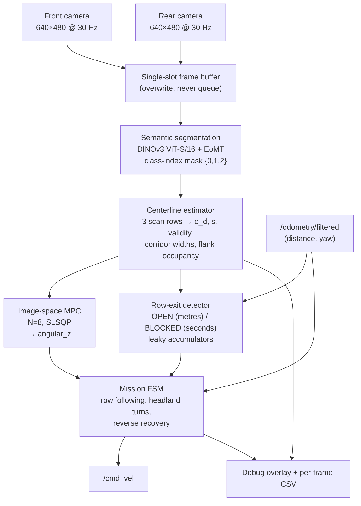
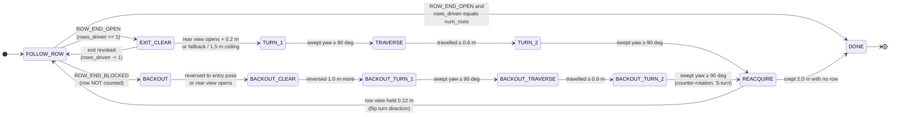

# AIAgNav: A Semantic-Segmentation-Based Autonomous Navigation System for Cornfields

**Authors:** Wei-Wei Chien, *et al.*, Multi-Scale Robotics and Automation Lab (MSRAL),
School of Mechanical Engineering, Purdue University
**Target venue:** IEEE ICRA 2027
**Document status:** technical draft — §II and §III are complete; §I, §IV, §V are stubs.
**Revision date:** 2026-08-07

---

> **How to read this document.** It follows the section structure of the lab's RA-L paper
> *P-AgNav: Range View-Based Autonomous Navigation System for Cornfields* so that it can
> be lifted into the paper draft with minimal restructuring. Sections II and III are
> written in full. The Introduction, Experimental Results and Conclusion are placeholders
> with bullet notes on what has to go in them.
>
> Every equation is numbered and is followed by an **"In plain terms"** paragraph that
> states the same thing without notation. Every numeric constant is given with the source
> file it lives in, so any number in the paper can be re-verified against the code.
> Anything that could not be established from the repository is marked **[TO CONFIRM]**
> rather than guessed.

---

## Abstract

**[STUB — write last.]** One paragraph, ~150 words, mirroring P-AgNav's abstract
structure: (i) the problem — in-row, under-canopy autonomous navigation in cornfields
without GNSS or pre-defined waypoints; (ii) what AIAgNav is — a navigation framework
driven by semantic segmentation of a single monocular RGB camera, using a DINOv3
vision-transformer backbone, with a model-predictive controller formulated directly in
normalized image space and a mission state machine that handles row exit, headland
turning and blocked-row recovery; (iii) the claim — comparable multi-row autonomy to the
lab's 3D-LiDAR system at a fraction of the sensor cost, with semantic information a range
sensor cannot provide; (iv) validation — simulation and real cornfield experiments at
Purdue ACRE.

**Index Terms** — Robotics and automation in agriculture and forestry, agricultural
automation, semantic segmentation, visual navigation, model predictive control.

---

## I. INTRODUCTION

**[STUB — outline only. Related-work citations are deliberately out of scope for this
revision.]**

Points to develop, in order:

1. **The problem.** Precision agriculture needs under-canopy ground robots; the space
   between corn rows is narrow, cluttered with hanging leaves, and GNSS is unreliable
   below the canopy.
2. **The lab's own lineage.** P-AgBot [2D LiDAR, `d_l`/`d_r` balancing] → P-AgSLAM →
   P-AgNav [3D LiDAR range view, four-stage multi-row navigation]. State plainly what
   P-AgNav already solves, because AIAgNav is a *sensor-modality* contribution on top of
   a solved navigation problem, not a claim that the problem was open.
3. **The gap this work addresses.** A range sensor returns geometry, not semantics.
   A hanging leaf and a corn stalk produce the same return; one is traversable and the
   other is not. A 3D LiDAR is also the single most expensive component on the robot.
   Camera-based alternatives exist (CropFollow's learned heading/distance regression;
   Agronav's segmentation plus semantic-line detection), each with limitations to
   discuss.
4. **Contributions** — three, mirroring P-AgNav's contribution list:
   - **C1.** A complete in-row and multi-row navigation system driven by a **single
     low-cost monocular RGB camera** (plus a second identical camera used only for
     reverse manoeuvres), with **no GNSS, no pre-defined waypoints, no LiDAR, and no
     camera calibration** — the entire control problem is posed in normalized image
     coordinates.
   - **C2.** A navigation state extracted from a semantic segmentation mask by **pure
     geometry rather than a learned regression head**, giving a two-dimensional state
     that is an invertible linear transform of the physical (lateral offset, heading
     error) pair (§III-B, Eq. 12), and which is consumed directly by a receding-horizon
     MPC **without any Bayesian filter**.
   - **C3.** A mission layer that handles every stage of multi-row operation, including a
     **rear-camera-steered headland exit leg** and a **blocked-row reverse recovery**,
     with end-of-row evidence accumulated in **physical units (metres and seconds) rather
     than frame counts**, so that identical tuning transfers across robots whose
     inference rates differ by an order of magnitude.
5. **A note on scope.** GNSS is used nowhere in AIAgNav. An RTK-GPS module for the
   *above-canopy* transit from the trailer to the row entrance is planned as future work
   and is explicitly outside the navigation system described here — consistent with the
   lab's position that in-row navigation must not depend on GNSS.

---

## II. SYSTEM OVERVIEW

This section describes the robot, explains why a monocular RGB camera was selected as the
primary navigation sensor, and gives the overall structure of the framework. Section III
then treats each module in detail.

### A. System Hardware: P-AgBot

AIAgNav runs on P-AgBot, the lab's Clearpath Robotics Jackal J100 platform, the same
robot used in the P-AgBot, P-AgSLAM and P-AgNav studies. For this work the robot carries
no LiDAR: the sensor set consists of two USB cameras and the platform's own wheel-odometry
and inertial state estimator.

**Cameras.** Two cameras are mounted on the top deck (`mid_mount`, the Jackal's accessory
plate), both configured at 640 × 480 at 30 Hz:

| Slot | Device | Interface | Topic | Role |
|---|---|---|---|---|
| Front | 5 MP wide-dynamic-range (WDR) USB camera | `yuyv` | `/usb_cam/image_raw/compressed` | Row following, row-exit detection |
| Rear | Logitech MX Brio | `mjpeg` | `/brio_rear/image_raw/compressed` | Headland exit leg, blocked-row reverse |

The two cameras are mounted as an **exact geometric mirror** about the robot centre. In
the simulation URDF (`agbot_bringup/urdf/agbot_camera.urdf.xacro`) the front camera sits
at `xyz = (+0.19, 0, 0.025)` relative to `mid_mount` and the rear at
`xyz = (−0.19, 0, 0.025)` with a 180° yaw — the same height, the same inset from its deck
edge, the same 80° horizontal field of view. This is not cosmetic. Section III-E derives
the transformation that lets the rear view steer the robot, and that derivation assumes
the reverse view is the geometric twin of the forward view. A different rear height or
inset would silently mistune the headland leg.

The camera resolution is chosen to match the segmentation training data exactly
(`agbot_vision_nav/launch/cameras.launch`): new footage recorded for annotation and the
live navigation input are the same size and the same rate, so no resolution domain gap is
introduced between training and deployment.

**Mount height.** The cameras were initially mounted on a 0.20 m stand. Mid-season this
configuration failed: as the corn grew, the elevated camera was frequently occluded by
leaves. The cameras were moved to the deck itself, which reduced leaf occlusion and, as a
secondary benefit, freed the stand volume for a robotic sampling arm without blocking the
view. The move had a measurable and initially unwelcome consequence for the perception
thresholds — the nominal in-row corridor width at the nearest scan row rose from ≈ 0.5 to
≈ 0.7 of the image width — which is discussed in §III-D and Appendix A.2.

**Compute.** Two physical Jackals were used, and the difference between them shaped the
entire real-time design:

| Robot | Compute | Inference latency | Achieved control rate |
|---|---|---|---|
| `cpr-j100-0463` | Stock Jackal PC, no discrete GPU (Haswell-class Xeon) | ≈ 500 ms/frame | ≈ 2 Hz |
| `cpr-j100-0864` | NVIDIA discrete GPU (CUDA 12.1) | 16 ms/frame (p95 16 ms) | ≈ 24 Hz |

A twelvefold spread in control rate across two instances of the same robot is the reason
several parameters in this system are expressed in metres and seconds rather than in
frames (§III-D), and the reason the MPC rescales its own dynamics to the true control
period (§III-C).

**Proprioception.** The only non-visual input is `/odometry/filtered`, the pose published
by the Jackal's stock `robot_localization` EKF (wheel encoders fused with the onboard
IMU). It is used for three things and nothing else: measuring distance travelled inside a
row (to arm and confirm end-of-row detection), closing the loop on the 90° headland turns,
and measuring path length for the autonomy metric. No map is built, and no global
localization is performed.

### B. Sensing Rationale: Why a Monocular RGB Camera

P-AgNav's central design argument is that a 3D LiDAR range view is a compact, illumination-
independent representation from which navigation features can be extracted cheaply. That
argument is sound, and AIAgNav does not dispute it. The motivation for the present work is
a different limitation, stated in the project's original design record:

> "The LiDAR's sparse point cloud has little inherent scene understanding — it can't tell
> sky from plant, for instance."

Three consequences follow.

**1) A range sensor cannot answer the question the controller actually asks.** The
navigation problem in a corn row reduces to a per-region question: *can the robot drive
there?* A range return of 0.6 m to the left is the same measurement whether it came from a
rigid stalk (which must be avoided) or from a hanging leaf (which the robot drives through
routinely). No amount of geometric post-processing recovers the distinction, because the
information was never in the measurement. A semantic segmentation network answers exactly
that question, per pixel, by construction.

**2) Cost.** A 3D LiDAR is the most expensive component in the sensor suite by a wide
margin. The cameras used here are commodity USB devices.

**3) Field of view and mounting.** A downward-and-forward-looking camera images the ground
plane directly ahead of the robot at multiple depths in a single frame. Section III-B
exploits this: measuring the corridor at three different depths in one image yields both
the lateral and the heading component of the navigation state without any temporal
filtering.

The costs of the choice are accepted explicitly and are addressed in the design rather
than denied:

| Cost of using a camera | How the design absorbs it |
|---|---|
| Sensitive to illumination — variable light under the canopy | The segmentation model is trained on real field footage spanning the conditions encountered, including edge cases (§III-A); the controller degrades to a defined safe stop when the mask is unusable (§III-C) |
| No metric depth | The entire control problem is posed in **normalized image coordinates**. No camera intrinsics, no extrinsics, no calibration, and no metric scale ever enters the control law (§III-C) |
| Narrower field of view than a 360° LiDAR | A second, mirrored rear camera covers the one manoeuvre the forward view cannot serve — reversing out of a blocked row — and the headland exit leg (§III-E, §III-F) |
| Occlusion by leaves on the lens | Detected as a persistent blocked-ahead signature and handled by the recovery branch; the residual failure mode (leaf on the glass is indistinguishable from a corn wall) is documented honestly in Appendix A.8 |

### C. Framework Overview

**Planting-structure assumptions.** As in P-AgNav, the field is assumed to consist of
approximately straight, parallel rows of uniform spacing, arranged in plots separated by
headland space wide enough for the robot to turn, with each row aligned to a corresponding
row in the opposite plot. The nominal row spacing used in the mission layer is 0.75 m
(`row_spacing`, `config/params.yaml`).

**Navigation stages.** AIAgNav covers the same four operational stages as P-AgNav, plus a
fifth that the LiDAR system does not have:

1. **In-row navigation** — drive down the row corridor, centred, under the canopy.
2. **Row-end classification** — decide, from the mask alone, whether the row has ended.
3. **Row switching** — execute the headland manoeuvre into the next row.
4. **Blocked-row recovery** — when the way ahead is impassable rather than open, reverse
   out of the row the way the robot came in, and lane-change into the next row.
5. **Termination and reporting** — stop after the commanded number of rows and report
   which rows were blocked.

**Pipeline.** Figure 1 shows the data flow. One frame enters, one `geometry_msgs/Twist`
leaves.

**Fig. 1. AIAgNav processing pipeline.**



Two properties of this pipeline are worth stating at the overview level.

**There is no state estimator between perception and control.** The segmentation mask is
converted to a two-element navigation state by closed-form geometry, and that state is
handed to the MPC directly. There is no Kalman filter, no learned regression head, and no
temporal fusion with the IMU. Temporal smoothing is instead a property of the *controller*
— a rate penalty and a rate constraint inside the optimization (§III-C) — which means the
smoothing is subject to the same constraints as the rest of the control problem rather
than being a separate tuning surface.

**Perception is shared, not duplicated.** The row-exit detector consumes the same scan
performed by the centerline estimator. Corridor widths and flank occupancy are by-products
of the boundary search that the controller already needed. End-of-row detection therefore
costs essentially nothing beyond the segmentation forward pass.

**Software architecture.** The package is deliberately split so that the algorithmic core
carries no ROS dependency:

```
agbot_vision_nav/
  src/agbot_vision_nav/          ← pure Python/NumPy, no rospy, unit-testable
    segmentation_model.py          model wrapper (the only file importing torch)
    centerline_estimator.py        scan-row geometry
    controller.py                  image-space MPC
    row_exit_detector.py           end-of-row classification
    mission_fsm.py                 multi-row mission state machine
    metrics_logger.py              per-run CSV instrumentation
    intervention_detector.py       autonomy metric
    debug_viz.py                   operator overlay
  scripts/
    vision_nav_node.py           ← the ONLY file that imports rospy
  config/params.yaml             ← single source of truth for every tuned constant
  test/                          ← 199 unit tests, no ROS or GPU required
```

Two reasons this structure was adopted, both recorded during development. First, the
deep-learning stack (`lightly_train`, `torch`) had only ever been run on Google Colab, and
its compatibility with the Python 3.8 shipped by ROS1 Noetic on Ubuntu 20.04 was an open
risk; isolating it behind one module meant that, if it proved incompatible, only that
module would need to move into a separate process publishing a mask topic. (The risk did
not materialise — a virtual environment with `torch==2.4.1`, the last release supporting
Python 3.8, resolved it.) Second, and more durably: the geometry, the controller, the
detector and the state machine can all be tested against synthetic arrays on any machine,
with no ROS installation, no GPU and no robot. The test suite grew from 22 tests at first
commit to **199** at the time of writing, and several of the field failures described in
Appendix A were converted into permanent regression tests the same day they were
diagnosed.

### Table I — Summary of Notations

| Symbol | Meaning | Where defined |
|---|---|---|
| $I_t$ | Input RGB frame at time $t$, $H \times W \times 3$ | §III-A |
| $M_t$ | Class-index mask, $M_t(y,x) \in \{0,1,2\}$ | Eq. (1) |
| $H, W$ | Image height and width in pixels (480, 640) | §III-A |
| $f_i$ | Scan-row height fraction, $i = 1\ldots3$ | Eq. (3) |
| $y_i$ | Pixel row of the $i$-th scan row | Eq. (3) |
| $c_x$ | Image centre column, $c_x = W/2$ | Eq. (4) |
| $x_{L,i}, x_{R,i}$ | Left/right bounds of the traversable corridor on scan row $i$ | Eq. (4) |
| $x_{m,i}$ | Corridor midpoint on scan row $i$ | Eq. (5) |
| $e_i$ | Normalized lateral offset measured on scan row $i$ | Eq. (5) |
| $w_i$ | Weight of scan row $i$ in the aggregate offset | Eq. (6) |
| $\mathcal{V}$ | Set of scan rows on which a corridor was found | Eq. (6) |
| $e_d$ | Aggregate normalized lateral error (MPC state component 1) | Eq. (6) |
| $s$ | Depth-difference term (MPC state component 2) | Eq. (7) |
| $e, \theta$ | Physical lateral offset (m) and heading error (rad) w.r.t. the row axis | Eq. (8) |
| $d_i$ | Ground distance imaged by scan row $i$ (m) | Eq. (8) |
| $c_1, c_2, c_3$ | Projection coefficients relating $(e,\theta)$ to $(e_d, s)$ | Eq. (8) |
| $\rho_{\text{trav}}, \rho_{\text{obs}}$ | Traversable / obstacle pixel fraction in the lower half of the mask | Eq. (9) |
| $\phi_{L,i}, \phi_{R,i}$ | Traversable occupancy of the outer strip at each side of scan row $i$ | Eq. (12) |
| $\mathbf{x}_k$ | MPC state, $\mathbf{x}_k = [e_{d,k},\, s_k]^\top$ | Eq. (13) |
| $u_k$ | MPC control, commanded angular velocity $\omega_z$ (rad/s) | Eq. (13) |
| $\alpha, \beta$ | Lateral-coupling and control-effectiveness constants | Eq. (14) |
| $\Delta t$ | Control period (s) | Eq. (15) |
| $\sigma$ | Reference-period scaling, $\sigma = \Delta t / 0.1$ | Eq. (15) |
| $N$ | Prediction horizon (8 steps) | Eq. (16) |
| $q_d, q_\psi$ | State cost weights (lateral, depth-difference) | Eq. (16) |
| $r, r_\Delta$ | Control-effort and control-rate cost weights | Eq. (16) |
| $\omega_{\max}$ | Steering magnitude limit (rad/s) | Eq. (18) |
| $\Delta\omega_{\max}$ | Steering slew limit (rad/s per reference step) | Eq. (19) |
| $v$ | Commanded forward velocity (m/s) | Eq. (21) |
| $\mathcal{W}_i$ | Normalized corridor width on scan row $i$ | Eq. (23) |
| $D$ | Accumulated OPEN evidence (metres) | Eq. (27) |
| $\lambda$ | Leak ratio of an evidence accumulator | Eq. (27) |
| $T$ | Accumulated BLOCKED evidence (seconds) | Eq. (28) |
| $\eta$ | Duty cycle of a signature (fraction of frames it holds) | Eq. (30) |
| $\delta_{\text{exit}}$ | Back-dating offset to the first sighting of the exit (m) | Eq. (31) |
| $\Psi$ | Accumulated swept yaw during a turn (rad) | Eq. (32) |
| $\kappa$ | Rear-to-front state conversion gain | Eq. (37) |

---

## III. SYSTEM DESIGN

### A. Semantic Segmentation

#### 1) Why a learned segmenter, and why a self-supervised foundation backbone

The perception task is to label every pixel of the forward view as *sky*, *drivable
ground*, or *plant/obstacle*. Classical approaches to this in agricultural imagery —
colour thresholding, excess-green indices, Hough-transform row-line fitting — are all
brittle under canopy, where the illumination varies within a single frame between direct
sun and deep leaf shadow, and where the "ground" may be soil, residue, weeds, or a downed
plant. This is precisely the regime in which the agricultural-robotics literature has
converged on learning.

The practical obstacle is data. Pixel-wise annotation is expensive; Agronav reports 60
hours of labelling for 120 images. The dataset available for this work is **443 annotated
frames**. That is one to three orders of magnitude below what is needed to train a
segmentation network from random initialisation, and it rules out the standard
from-scratch encoder–decoder approach.

**This is exactly the regime that a self-supervised vision-transformer foundation model is
designed for.** DINOv3 is a vision transformer pre-trained by Meta on more than a billion
images with no labels at all. Its self-supervised objective produces patch-level features
that are already densely semantic — they separate object regions without ever having been
told what an object is. Fine-tuning a segmentation head on such features requires only
enough labelled data to *name* the regions the backbone already distinguishes, not enough
to learn the notion of a region in the first place. A dataset of a few hundred frames is
sufficient in that setting and is not sufficient in any other.

> **In plain terms:** the model already knows how to see. The 443 annotated images only
> teach it which of the things it can already see are "sky", "ground you can drive on",
> and "plant you cannot".

**Honest attribution.** The segmentation training pipeline was built by a previous student
in the lab and was inherited by this work; the contribution of the present work is the
closing of the loop from that mask into a working controller. **No benchmark comparing
DINOv3 against alternative segmentation backbones was performed**, and none should be
claimed. The empirical support for the choice is the achieved segmentation quality
(§III-A.4) and the field results, not a model ablation. If the reviewers ask for a
comparison, it does not exist yet — see Appendix A.8.

#### 2) Model configuration

The model is trained through the `lightly_train` library
(`segmentation/Train.py`), with the following configuration, quoted exactly:

| Setting | Value | Note |
|---|---|---|
| `model` | `"dinov3/vits16-eomt"` | DINOv3 **ViT-S/16** encoder + **EoMT** (encoder-only mask transformer) segmentation head |
| `transform_args.image_size` | `(224, 224)` | Training resolution |
| `steps` | `2500` | Step budget ("roughly 500 steps for every 20 images") |
| `batch_size` | `2` | Deliberately small; VRAM-constrained |
| `precision` | `"16-mixed"` | FP16 mixed precision |
| `ignore_classes` | `[]` | No class is excluded from the loss |
| `out` | `out/corn_field_navigation` | Produces `exported_models/exported_best.pt`, ≈ 93 MB |

The backbone is the **small** ViT variant with a **16 × 16 patch size**. At the 224 × 224
training resolution this gives a 14 × 14 grid of patch tokens. The choice of the small
variant over a larger one is a real-time constraint, not an accuracy preference: the model
must run on a mobile robot inside a control loop, and on the CPU-only Jackal it must run
at all.

The **EoMT** head is an encoder-only mask transformer: rather than bolting a
convolutional decoder onto the transformer, it produces segmentation masks from the
encoder's own tokens using learned queries. The practical consequence is that almost all
of the parameters and almost all of the pre-trained knowledge live in the part of the
network that was trained on a billion images, and the part being fit to 443 images is
small.

> **[TO CONFIRM] — a genuine gap in the record.** The loss function, optimizer, learning
> rate, learning-rate schedule, weight decay, augmentation policy, and number of epochs
> are **not specified anywhere in this codebase.** `Train.py` calls the high-level
> `lightly_train.train_semantic_segmentation()` API and everything below that abstraction
> is a library default that is never overridden, logged, or printed. These values must be
> read out of the `lightly_train` package before the paper is submitted. They are not
> guessed here.

#### 3) Why three classes

The class set is fixed at three (`Train.py`; mirrored as constants in
`centerline_estimator.py:22-24`):

| Index | Name | Meaning |
|---|---|---|
| 0 | `sky` | Sky and far background above the horizon |
| 1 | `traversable` | Drivable ground between the rows |
| 2 | `obstacle` | Corn plants, stalks, leaves, and anything else not drivable |

The controller only ever needs one bit per pixel — *drivable or not*. It is therefore
worth stating precisely why the label space is not binary.

**A binary split fails because "not drivable ground" is not one thing.** In every
under-canopy frame the upper portion of the image is sky or bright far-field background.
Under a two-class scheme it must be merged into one of the two classes, and both merges
break something downstream:

- **Merge sky into `traversable`.** The corridor scan (§III-B) walks outward from the
  image centre through contiguous traversable pixels. Near the horizon, the drivable
  ground and the sky meet. Merging them lets the corridor leak upward and sideways into
  the sky region, and the corridor width — the quantity that decides whether the row has
  ended (§III-D) — becomes meaningless on any scan row near the horizon.
- **Merge sky into `obstacle`.** The blocked-ahead test (§III-D) fires when the lower half
  of the frame is dominated by obstacle pixels. Under this merge, bright sky visible
  through a thin canopy would count as evidence of an obstruction, and the failure
  direction is dangerous: the robot would stop and reverse out of a perfectly open row.

Keeping sky as its own class makes the ambiguity explicit rather than assigning it
arbitrarily. Sky is, in the current implementation, a **separator class**: it exists so
that the two classes the controller *does* read stay clean.

**A documented consequence, stated honestly.** `CLASS_SKY` is defined in
`centerline_estimator.py` and is **never read anywhere downstream**. Both region fractions
(Eq. 8) are measured over the *lower half* of the mask only, so the top of the frame is
discarded before anything can reason about it. This is recorded in the project log as an
unexploited signal, and it is the natural fix for one of the system's known failure modes:
a corn wall one metre ahead has sky above it, whereas a leaf lying on the lens fills the
entire frame. Today the system cannot tell those apart and treats both as *blocked*
(Appendix A.8, defect 4). The third class is therefore better described as *trained and
available but only partly used* than as *unnecessary*.

**A fourth class was never introduced,** and the reason is data economy: every additional
class multiplies annotation cost on a dataset that is already the binding constraint, and
none of the candidate distinctions (weed vs. crop, soil vs. residue) changes any control
decision the robot currently makes.

#### 4) Dataset, annotation, and measured quality

The dataset was produced by the following pipeline:

1. Record rosbags of the forward camera while driving the robot through real corn rows.
2. Convert the rosbags to video.
3. Extract frames and hand-select the ones to annotate.
4. Annotate polygons in **Make Sense AI**, labelling regions as sky, traversable, or
   untraversable. *(An alternative CVAT/COCO path also exists in the training repository,
   with a `Convert_type.py` step remapping COCO category IDs 1, 2, 3 to mask values 0, 1,
   2. Pixels left unannotated default to class 0.)*
5. Rasterise the annotations to masks and split into training and validation sets.
6. Train with `Train.py`.

**Frame selection was deliberately edge-case weighted**, which matters more than the raw
count. Beyond nominal in-row frames, the annotated set includes the robot turning into a
new row, facing a dead-end row, passing a section with missing corn plants on one side,
and driving over corn lying on the ground. The design intent was a model that degrades
gracefully in exactly the situations that later turned out to cause the field failures in
Appendix A.

| Dataset property | Value |
|---|---|
| Total annotated images | **443** |
| Train / validation split | **80 % / 20 %** |
| Camera-position mix | **≈ 75 % tall mount, ≈ 25 % low mount** |
| Image resolution | 640 × 480 |
| **Achieved mIoU** | **0.8717** |

By the conventional reading of mean intersection-over-union, a value in the 0.75–0.90
band indicates excellent segmentation quality, and 0.8717 sits comfortably inside it.

**A known weakness to disclose.** The tall/low mount imbalance means the model has seen
roughly 300 tall-camera frames against roughly 100 low-camera frames, while the deployed
configuration is the *low* mount. Low-mount masks are consequently weaker toward the image
sides, and this directly shaped a threshold in the exit detector: the flank-occupancy
requirement is set at 0.8 rather than 1.0 specifically so that a single stray misclassified
pixel near a border cannot veto a correct end-of-row detection (§III-D). Collecting more
low-mount annotations is an outstanding item.

#### 5) Inference contract

At run time the model is loaded once and held in evaluation mode
(`segmentation_model.py`):

$$
M_t \;=\; \operatorname{argmax}_c \; f_\theta\big(I_t\big) \;\in\; \{0,1,2\}^{H \times W}
\tag{1}
$$

The `lightly_train` API performs the arg-max internally: `model.predict()` returns class
indices, not logits. The wrapper converts BGR to RGB, wraps the frame as a PIL image,
calls `predict()`, moves the result to the CPU, squeezes singleton dimensions, and casts
to `uint8`.

> **In plain terms:** one RGB frame goes in, and one integer per pixel comes out — 0, 1 or
> 2. There is no probability map and no threshold to tune.

**One implementation detail is load-bearing.** `lightly_train`'s `predict()` may return a
mask at its internal working resolution rather than at the input resolution. The wrapper
therefore forces the mask back to the frame's exact $(H, W)$, and it must do so with
**nearest-neighbour interpolation**:

$$
M_t \leftarrow \operatorname{resize}_{\text{NN}}\big(M_t,\; (H, W)\big)
\tag{2}
$$

Mask values are *class labels, not intensities*. Bilinear interpolation between a
traversable pixel (1) and an obstacle pixel (2) would produce values such as 1.5, which
after casting become a class the model never predicted — inventing spurious boundaries
exactly along the corn edges that the corridor scan depends on. Nearest-neighbour is the
only admissible choice.

**Device selection.** The model is moved to CUDA when available and otherwise stays on the
CPU, and the node logs the device on which inference actually runs. This is a deliberate
diagnostic: a GPU robot silently falling back to CPU is a twelvefold loss in control rate
that is otherwise invisible until the robot behaves badly in a row.

---

### B. Centerline Estimation: Geometry, Not Regression

This module converts the class-index mask into the two-element navigation state consumed
by the controller. It is pure NumPy, roughly 220 lines, and contains no learned
parameters. Its design descends from the per-scanline boundary-midpoint centerline
definition used in Agronav, and it is the image-space analogue of the lab's LiDAR
controller, which centres the robot by balancing the measured left and right distances
$d_l$ and $d_r$.

#### 1) Scan rows

Rather than processing the entire mask, the estimator samples three horizontal scan lines
at fixed fractions of the image height:

$$
y_i \;=\; \operatorname{round}\!\big(f_i \,(H-1)\big),
\qquad
f = (0.65,\; 0.78,\; 0.92)
\tag{3}
$$

With $H = 480$ these fall at rows 311, 374 and 441. Because the camera looks forward and
downward, a larger fraction is *closer* to the robot: $f_3 = 0.92$ images the ground
roughly at the bumper, and $f_1 = 0.65$ images the ground several metres ahead. On the
deployed rig the three rows image ground distances of approximately **3 m, 2 m and 1 m**
respectively.

> **In plain terms:** instead of looking at the whole picture, the robot looks along three
> horizontal lines — one far ahead, one at middle distance, one right in front of its
> bumper — and asks the same question on each.

#### 2) Corridor bounds

On each scan row, the estimator scans **outward from the image centre column**
$c_x = W/2$ through contiguous traversable pixels:

$$
\begin{aligned}
x_{L,i} &= \min \big\{\, x \le c_x \;:\; M(y_i, x') = 1 \;\; \forall\, x' \in [x, c_x] \,\big\}\\[2pt]
x_{R,i} &= \max \big\{\, x \ge c_x \;:\; M(y_i, x') = 1 \;\; \forall\, x' \in [c_x, x] \,\big\}
\end{aligned}
\tag{4}
$$

If the centre pixel itself is not traversable, the row yields no corridor and is marked
invalid.

> **In plain terms:** starting from directly in front of the robot, walk left until you
> hit something that is not drivable ground, then walk right until you hit something that
> is not drivable ground. Those two stopping points are the walls of the lane you are in.

Two properties of this construction matter. First, it returns the **contiguous** drivable
run containing the robot's heading, not every drivable pixel on the row — a patch of
ground visible through a gap in the corn on the far side of a plant does not widen the
measured corridor. Second, requiring the centre column itself to be traversable means the
measurement is always taken along the robot's actual heading, which is what makes it
directly comparable to the LiDAR system's $d_l$/$d_r$ readings.

#### 3) Lateral error

The corridor midpoint and its normalized deviation from the image centre are

$$
x_{m,i} \;=\; \tfrac{1}{2}\big(x_{L,i} + x_{R,i}\big),
\qquad
e_i \;=\; \frac{x_{m,i} - c_x}{W/2} \;\in\; [-1, 1]
\tag{5}
$$

and the aggregate lateral error is the weighted mean over rows that produced a corridor:

$$
e_d \;=\; \operatorname{clip}\!\left(
\frac{\displaystyle\sum_{i \in \mathcal{V}} w_i \, e_i}{\displaystyle\sum_{i \in \mathcal{V}} w_i},\;
-1,\; 1 \right),
\qquad
w = (0.2,\; 0.3,\; 0.5)
\tag{6}
$$

where $\mathcal{V}$ is the set of scan rows on which a corridor was found.

> **In plain terms:** each of the three lines reports how far the lane's middle sits from
> the middle of the picture. Positive means the lane is off to the right, so the robot is
> sitting too far left. The three readings are averaged, with the line nearest the robot
> counting the most.

Two details of Eq. (6) are deliberate. The weights need not sum to one because the
denominator is the sum of the weights of *valid* rows only — an invalid row drops out of
the numerator **and** the denominator, so losing the far row rescales the estimate rather
than biasing it toward zero. And the near row carries weight 0.5 because it is the
measurement the robot must act on soonest; the far rows contribute lookahead.

#### 4) The second state component

The second element of the state is the difference between the offsets measured at the
farthest and nearest valid scan rows:

$$
s \;=\; e_{\text{far}} - e_{\text{near}}
\tag{7}
$$

computed **across rows within a single frame**, not across time. If fewer than two rows
are valid, $s = 0$.

This is the single cheapest part of the perception system and one of its most important
design decisions, so it is worth being precise about what $s$ actually measures. Model the
row axis under a pinhole camera. A scan row imaging ground distance $d_i$ observes the
row axis displaced by

$$
e_i \;\approx\; k \left( \frac{e}{d_i} + \tan\theta \right)
$$

where $e$ is the robot's physical lateral offset from the row axis and $\theta$ its
heading error. Substituting into Eqs. (6) and (7):

$$
\boxed{\;
\begin{bmatrix} e_d \\ s \end{bmatrix}
=
\underbrace{\begin{bmatrix} c_1 & c_2 \\ -c_3 & 0 \end{bmatrix}}_{\textstyle \mathbf{C}}
\begin{bmatrix} e \\ \tan\theta \end{bmatrix},
\qquad
c_1 = k\!\!\sum_i \frac{w_i}{d_i},
\quad c_2 = k,
\quad c_3 = k\left(\frac{1}{d_{\text{near}}} - \frac{1}{d_{\text{far}}}\right)
\;}
\tag{8}
$$

Note what happened in the second row: **the heading term cancelled exactly.** Taking the
difference of two offsets measured at different depths removes $\tan\theta$, because
heading displaces every depth by the same amount while lateral offset displaces near
depths more than far ones. So $s$ is a *depth-difference lateral readout*, and $e_d$ mixes
lateral and heading.

Crucially, $\det \mathbf{C} = c_2 c_3 \neq 0$, so $\mathbf{C}$ is **invertible**: the state
$[e_d,\, s]^\top$ is a linear, invertible transform of the physical pair
$[e,\, \tan\theta]^\top$. The controller therefore has full observability of both the
lateral and the heading error, expressed in a rotated basis, at the cost of one
subtraction.

> **In plain terms:** looking at the lane at three different distances in one photograph
> tells you both how far sideways you are and which way you are pointing. If you are
> parallel to the row but off to one side, the near part of the lane looks badly
> off-centre while the far part looks nearly centred — that difference is what $s$
> measures. If you are pointed the wrong way but centred, the whole lane tilts uniformly,
> and the difference cancels out.

The saving relative to comparable systems is direct. CropFollow trains a ResNet-18
regression head to predict heading and distance, then filters the predictions with an
extended Kalman filter. AIAgNav obtains an equivalent two-dimensional state from a
subtraction of two numbers the corridor scan had already computed: **no second network, no
extra forward pass, no filter, and no history.**

> **A terminology note for the paper.** The controller's source documentation calls $s$ a
> "heading proxy". Equation (8) shows this is loose — the heading term cancels exactly and
> $s$ is proportional to $e$. The system works because the *pair* spans the same space as
> $(e, \theta)$, not because $s$ alone measures heading. The paper should use the precise
> statement. **[TO RECONCILE with the code comments before submission.]**

#### 5) Region fractions and validity

Two scalar summaries are computed over the lower half of the mask:

$$
\rho_{\text{trav}} = \frac{1}{|\mathcal{L}|}\!\!\sum_{p \in \mathcal{L}}\!\! \mathbb{1}[M(p) = 1],
\qquad
\rho_{\text{obs}} = \frac{1}{|\mathcal{L}|}\!\!\sum_{p \in \mathcal{L}}\!\! \mathbb{1}[M(p) = 2],
\qquad
\mathcal{L} = M\!\left[\tfrac{H}{2}\!:,\; :\right]
\tag{9}
$$

and a frame is declared usable only if a corridor was found on at least one scan row *and*
enough drivable ground is visible:

$$
\text{valid} \;=\; \big(|\mathcal{V}| \ge 1\big) \;\wedge\; \big(\rho_{\text{trav}} \ge 0.10\big)
\tag{10}
$$

> **In plain terms:** the robot only trusts a frame if it can actually see a lane in front
> of it and at least a tenth of the ground ahead is drivable. Otherwise it reports "I do
> not know", and the controller decides what to do about it (§III-C).

#### 6) A measurement that is not a measurement

One subtlety in Eq. (4) is important enough to be its own result, because it caused two
separate field defects.

The outward scan stops when it hits a non-traversable pixel **or when it runs out of
image**, and $x_{L,i}$, $x_{R,i}$ cannot distinguish the two. If the corridor extends past
the left border, $x_{L,i} = 0$ is not a corn boundary — it is the edge of the sensor. The
midpoint in Eq. (5) then averages one real boundary against one fictitious one and is
dragged toward the image centre. A row clipped on *both* sides reports $e_i = 0$ exactly,
regardless of where the robot actually is.

The system therefore exposes a predicate that asks whether the nearest scan row's corridor
is genuinely bounded:

$$
\text{bounded} \;=\; \big(x_{L,\text{near}} > 0\big) \;\wedge\; \big(x_{R,\text{near}} < W-1\big)
\tag{11}
$$

> **In plain terms:** if the drivable lane runs off the side of the picture, the robot does
> not actually know where the middle of the lane is. Eq. (11) is how it detects that, so
> it can decline to steer instead of steering on a number it invented.

The nearest row is the one checked because it clips most often and carries the largest
weight. Measured on simulation logs, the near row is border-clipped in **22–33 % of
in-row frames** while the far row is clipped in **0 %**. Inside a row this is a bias.
In a headland — where the corridor genuinely does run off the frame — it is the *normal*
case, and steering on it drove the robot in a slow circle at maximum steering rate for an
entire headland leg (Appendix A.5). Note that the validity test of Eq. (10) cannot catch
this: it counts pixels over the lower half and says nothing about whether the corridor
left the frame.

#### 7) Flank occupancy

Finally, for each scan row the estimator measures the traversable **occupancy** of a
narrow strip at each border, of width $m = \max(1, \lfloor 0.05\,W \rceil)$ pixels:

$$
\phi_{L,i} = \frac{1}{m}\sum_{x=0}^{m-1} \mathbb{1}\big[M(y_i,x) = 1\big],
\qquad
\phi_{R,i} = \frac{1}{m}\sum_{x=W-m}^{W-1} \mathbb{1}\big[M(y_i,x) = 1\big]
\tag{12}
$$

These feed the end-of-row test in §III-D. Occupancy is measured rather than asking how far
the contiguous corridor reached, and the reason is robustness: a single misclassified
pixel eight per cent of the way in from the border would truncate the outward scan and
veto flank-clearance outright, whereas it moves an occupancy fraction by $1/m$. Given the
known weakness of the low-mount masks toward the image sides (§III-A.4), this distinction
is not hypothetical.

---

### C. Model Predictive Row-Following Control

This is the module the reviewers will scrutinise most closely, and it is where AIAgNav
departs most clearly from both the lab's prior work and the camera-based literature.

#### 1) Problem statement and why it is posed in image space

The state and control are

$$
\mathbf{x}_k = \begin{bmatrix} e_{d,k} \\ s_k \end{bmatrix} \in \mathbb{R}^2,
\qquad
u_k = \omega_{z,k} \;\; \text{(rad/s, positive} = \text{left turn, REP-103)}
\tag{13}
$$

with $e_d$ and $s$ exactly as delivered by §III-B — that is, in **normalized image
coordinates**, dimensionless, on $[-1,1]$.

This is a deliberate and consequential choice. P-AgNav's MPC state is a pixel column in a
range-view image; CropFollow's is a metric heading and a metric distance ratio. AIAgNav's
is neither: it is a dimensionless image-space error. The consequences are:

- **No camera calibration is required.** No intrinsic matrix, no lens distortion model, no
  extrinsic mounting transform. There is nothing to calibrate and therefore nothing to
  mis-calibrate.
- **The controller is resolution-agnostic.** Changing the camera resolution does not
  change any gain, because the error is normalized by the image half-width.
- **Camera mount changes do not invalidate the control law.** They change the *scale* of
  the error signal (which is why $e_d$ must never be quoted as a distance in metres —
  §III-H), but the loop remains well posed.
- **The price:** the gains $\alpha$ and $\beta$ absorb the unknown image-to-world scale
  and therefore cannot be derived analytically without intrinsics and corridor geometry.
  They are tuned empirically. This is stated in the design record and should be stated in
  the paper.

> **In plain terms:** the robot never asks "how many centimetres am I off the row?" It
> asks "how far off-centre does the lane look, as a fraction of the picture?" and steers
> on that. This is why the same code runs unchanged on two robots with different cameras
> at different heights.

#### 2) Prediction model

The internal model is a two-state discrete linear time-invariant system:

$$
\mathbf{x}_{k+1} = \mathbf{A}\,\mathbf{x}_k + \mathbf{B}\,u_k,
\qquad
\mathbf{A} = \begin{bmatrix} 1 & \alpha\sigma \\[2pt] 0 & 1 \end{bmatrix},
\qquad
\mathbf{B} = \begin{bmatrix} 0 \\[2pt] \beta\sigma \end{bmatrix}
\tag{14}
$$

with $\alpha = \beta = 0.10$ and the reference-period scaling

$$
\sigma \;=\; \frac{\Delta t}{0.1\,\text{s}}
\tag{15}
$$

> **In plain terms:** the model says two things. First, if the lane is tilted (the $s$
> state is non-zero), the robot will drift sideways over the next step — that is the
> $\alpha$ term. Second, if the robot commands a turn, the tilt changes — that is the
> $\beta$ term. Steering does not move the robot sideways instantly; it changes which way
> the robot is pointing, and *that* moves it sideways over the following steps. The model
> captures exactly this two-stage causality and nothing more.

**Why Eq. (15) exists** is a fleet-management result rather than a control-theory one.
$\alpha$, $\beta$ and the slew limit $\Delta\omega_{\max}$ are all specified at a
*reference control period of 0.1 s*. The actual control period varies by an order of
magnitude across the fleet: 0.1 s on the GPU robot, 0.5 s on the CPU-only robot. Scaling
by $\sigma$ means the model's per-step drift, per-step control authority, and per-step
slew allowance all track the real elapsed time, so a single tuning is correct on both
machines and the slew limit stays constant in rad/s per *second* rather than per *step*.
Before this scaling was implemented, running the tuned $\Delta t = 0.1$ dynamics on a
robot that actually held each command for 0.5 s made every correction approximately five
times too strong, and the controller saturated against its clamp on any non-zero offset.

#### 3) Cost function

Over a horizon of $N = 8$ steps:

$$
J \;=\; \sum_{k=1}^{N}\Big( q_d\, e_{d,k}^2 \;+\; q_\psi\, s_k^2 \Big)
\;+\; \sum_{k=0}^{N-1}\Big( r\, u_k^2 \;+\; r_\Delta\, (u_k - u_{k-1})^2 \Big)
\tag{16}
$$

or equivalently, with $\mathbf{Q} = \operatorname{diag}(q_d,\, q_\psi)$,

$$
J \;=\; \sum_{k=1}^{N} \mathbf{x}_k^\top \mathbf{Q}\, \mathbf{x}_k
\;+\; \sum_{k=0}^{N-1}\Big( r\, u_k^2 + r_\Delta\,(u_k - u_{k-1})^2 \Big),
\qquad u_{-1} \equiv u^\star_{\text{applied}}
\tag{17}
$$

Tuned weights (`config/params.yaml`):
$q_d = 10.0$, $q_\psi = 1.0$, $r = 0.1$, $r_\Delta = 0.5$.

> **In plain terms, term by term:**
> - $q_d\,e_d^2$ — **stay in the middle of the row.** The dominant term, weighted ten times
>   the next; being off-centre is the thing the robot is actually trying not to be.
> - $q_\psi\,s^2$ — **do not sit crooked in the row.** Prevents the controller from
>   settling into a centred-but-angled pose that will drift out.
> - $r\,u^2$ — **do not steer harder than necessary.** A mild effort penalty; deliberately
>   small, because in a narrow row the robot needs its steering authority.
> - $r_\Delta\,(u_k-u_{k-1})^2$ — **do not steer *differently* from last time.** This is
>   the one that keeps the wheels from chattering, and it is where the temporal smoothing
>   lives.

The last point deserves emphasis, because it is a structural difference from CropFollow.
CropFollow smooths its perception with an extended Kalman filter and then controls the
filtered estimate. AIAgNav does not filter the measurement at all; it penalises *changes
in the command* inside the optimization. The smoothing therefore happens where the
constraints are, and it cannot fight the controller — an aggressively tuned filter and an
aggressively tuned controller are a classic source of instability, and this formulation
does not have two things to tune against each other. There is no EKF and no IMU in the
loop.

Note also that $u_{-1}$ in Eq. (17) is the **last command actually applied to the robot**,
carried across solver invocations, not the last element of the previous solution. The rate
penalty and the rate constraint therefore act across the seam between successive solves,
not merely inside a single horizon.

#### 4) Constraints

$$
|u_k| \;\le\; \omega_{\max}, \qquad k = 0,\ldots,N-1
\tag{18}
$$

$$
|u_k - u_{k-1}| \;\le\; \Delta\omega_{\max}\,\sigma, \qquad k = 0,\ldots,N-1,
\qquad u_{-1} \equiv u^\star_{\text{applied}}
\tag{19}
$$

with $\omega_{\max} = 0.175$ rad/s and $\Delta\omega_{\max} = 0.2$ rad/s per reference
step. Equation (18) enters the solver as box bounds; Eq. (19) as $2N = 16$ inequality
constraints. There are $N = 8$ scalar decision variables.

> **In plain terms:** Eq. (18) caps how hard the robot may turn. Eq. (19) caps how fast it
> may *change* how hard it is turning — a slew-rate limit, which is what stops the
> commanded steering from jumping between extremes on consecutive frames.

$\omega_{\max}$ was originally 0.3 rad/s. Field testing on real corn showed the robot
wobbling and contacting plants at that limit, and it was reduced to 0.175 rad/s
(2026-07-15). A later field session raised it back to 0.25 rad/s to test whether the
controller was steering-limited; it changed nothing, because the controller was never
saturating — which turned out to be positive evidence for a constant physical disturbance
rather than insufficient control authority (Appendix A.3).

#### 5) Solution and the receding-horizon step

Problem (16)–(19) is solved at every control tick by sequential least-squares quadratic
programming (SLSQP, `scipy.optimize.minimize`) with `ftol = 1e-6`, `maxiter = 100`, and a
cold start $u^0 = \mathbf{0} \in \mathbb{R}^8$. Only the first element of the solution is
applied:

$$
u^\star \;=\; \operatorname{clip}\!\big( \arg\min_{u_{0:N-1}} J \;\big|_{\,0}\,,\;
-\omega_{\max},\; \omega_{\max} \big)
\tag{20}
$$

and the whole problem is re-solved on the next frame from the new measurement. With eight
decision variables the solve costs well under a millisecond even on CPU, which is
negligible beside the 16–500 ms segmentation forward pass — the optimizer is never the
bottleneck. The redundant clip in Eq. (20) is a defence-in-depth measure against a solver
returning a marginally infeasible point.

#### 6) Forward velocity

$$
v \;=\; v_{\text{cruise}} \;=\; 0.15\;\text{m/s} \quad\text{(constant)}
\tag{21}
$$

This is a deliberate departure from P-AgNav, which couples velocity to steering as
$v_t = \min(c/|\omega_t|,\, v_{\max})$, slowing the robot as it turns harder. AIAgNav holds
forward speed constant during row following and lets $\alpha$ and $\beta$ carry the speed
dependence: those two constants are tuned *for* 0.15 m/s and must be scaled proportionally
if cruise speed is raised. The reasons for the simpler law are that the operating envelope
is already conservative — crop monitoring and physical sampling favour slow, safe traverse
over speed — and that a state-dependent velocity introduces a coupling between the linear
and angular channels that the two-state image-space model does not represent, so it could
not be reasoned about within this formulation.

Different speeds are used in specific mission states — 0.10 m/s on the headland exit leg,
0.08 m/s while reacquiring a row, −0.10 m/s while reversing — and those are set by the
mission layer, not by the controller (§III-E, §III-F).

#### 7) Sign convention

Sign errors are the most persistent class of bug in this system, so the convention is
stated explicitly and is pinned by unit tests rather than by inspection. Image $x$
increases rightward; positive $\omega_z$ is a left turn under REP-103.

| Observation | Meaning | Correct response |
|---|---|---|
| $e_d < 0$ | Lane appears left of image centre; robot is too far **right** | $\omega_z > 0$ — turn **left** |
| $e_d > 0$ | Lane appears right of image centre; robot is too far **left** | $\omega_z < 0$ — turn **right** |
| $s > 0$ | Lane tilts rightward with depth | $\omega_z < 0$ — corrective **right** |

Note that these signs are **not hard-coded anywhere**. They emerge from the optimization:
with $\alpha, \beta > 0$, reducing a positive $e_d$ requires driving $s$ negative, which
requires $u < 0$. This is a property worth stating in the paper, because it means the sign
convention is a consequence of the model rather than a convention that could drift out of
agreement with it.

The controller's internal state — $u_{-1}$ and the invalid-frame counter — is reset
(`reset()`) whenever the *steering reference frame* changes: on entering row following, on
entering the reverse manoeuvre, and on entering the rear-steered headland leg. Without
this, the rate limiter of Eq. (19) would carry a command issued under one sign convention
into a state that uses another.

#### 8) Behaviour on unusable frames

When Eq. (10) reports the frame unusable, the controller does not solve. It holds the last
command and counts consecutive failures; after $n_{\text{invalid}} = 5$ consecutive
unusable frames it latches to a full stop:

$$
(v, \omega_z) \;=\;
\begin{cases}
(v_{\text{cruise}},\, u^\star) & \text{valid frame}\\[4pt]
(v,\, \omega_z)_{\text{previous}} & \text{invalid, count} < 5\\[4pt]
(0,\, 0) & \text{invalid, count} \ge 5
\end{cases}
\tag{22}
$$

> **In plain terms:** one bad frame — a leaf flicking past the lens — should not make the
> robot lurch, so it keeps doing what it was doing. Five bad frames in a row means
> perception is genuinely lost, and the robot stops.

Separately, a 10 Hz timer republishes the most recent command regardless of the inference
rate. This is a platform requirement, not a control decision: the Jackal's base controller
brakes if `cmd_vel` goes silent for a few hundred milliseconds, so publishing only once
per inference on a 2 Hz robot produced a visible surge–brake–surge gait. A watchdog on the
same timer publishes a zero command if no successful inference has completed within
`max_data_age_sec` (0.5 s with a GPU; 1.5–3.0 s on the CPU robot, where every frame
otherwise arrives at the deadline and produces constant stop–go stutter).

#### 9) Tuned values and tuning order

| Symbol | Parameter | Value | Source of the value |
|---|---|---|---|
| $N$ | `mpc_horizon` | 8 | Sub-millisecond solve; longer adds no observed benefit |
| $\Delta t$ | `mpc_dt` | 0.1 s (GPU) / 0.5 s (CPU) | Must equal the true control period |
| $\alpha$ | `mpc_alpha` | 0.10 | Empirical; scales with cruise speed |
| $\beta$ | `mpc_beta` | 0.10 | Empirical |
| $q_d$ | `mpc_q_offset` | 10.0 | Primary tuning knob |
| $q_\psi$ | `mpc_q_heading` | 1.0 | Raise if the robot drifts wide on bends |
| $r$ | `mpc_r_control` | 0.1 | Kept small; authority is needed in a narrow row |
| $r_\Delta$ | `mpc_r_delta` | 0.5 | Raise to suppress growing oscillation |
| $v_{\text{cruise}}$ | `linear_x_cruise` | 0.15 m/s | Sim- and field-validated envelope |
| $\omega_{\max}$ | `angular_z_max` | 0.175 rad/s | 0.3 wobbled into corn (field, 2026-07-15) |
| $\Delta\omega_{\max}$ | `delta_angular_z_max` | 0.2 rad/s per 0.1 s | Slew limit |
| $n_{\text{invalid}}$ | `invalid_frame_stop_count` | 5 | Consecutive unusable frames before stop |

The documented tuning order is: **verify the sign convention first**, then $\alpha,\beta$,
then $q_d$, then $r_\Delta$, then $q_\psi$, then $r$. Diagnostic rules recorded from field
sessions: a square-wave $\omega_z$ riding the clamp means the robot is too fast for the
loop rate; a smooth, growing oscillation means raise $r_\Delta$ or lower $q_d$; drifting
wide on bends means raise $q_\psi$.

#### 10) Relationship to comparable controllers

| | P-AgNav | CropFollow | Agronav | **AIAgNav** |
|---|---|---|---|---|
| Sensor | 3D LiDAR range view | Monocular RGB | Monocular RGB | Monocular RGB |
| Perception output | Blob centroid column | Regressed $(\varphi, d)$ | Two Hough boundary lines | 3-scan-row corridor midpoints |
| Learned components | none (blob detection) | ResNet-18 regression head | Segmentation + Deep Hough | Segmentation only |
| State estimation | none | EKF + IMU | none | **none** |
| Control state | pixel column $x_t$ | $(\varphi, d)$, metric | centerline | $[e_d, s]$, normalized image space |
| Controller | MPC | MPC | downstream planner | MPC ($N=8$, SLSQP) |
| Smoothing | $(\omega_t - \omega_{t-1})^2$ in cost | EKF | — | $r_\Delta$ term + slew constraint |
| Speed law | $v = \min(c/|\omega|, v_{\max})$ | — | — | constant $v_{\text{cruise}}$ |

The distinguishing property of AIAgNav's controller is what it *does not* contain: no
regression head to train and validate, no Hough transform to fit, no Bayesian filter to
tune, and no calibration. The navigation state falls out of the segmentation mask by
closed-form geometry, and every remaining degree of freedom is inside a single
constrained optimization.

---

### D. Row-Exit Detection: Classifying the End of a Row

The controller of §III-C will follow a corridor for as long as one exists. Something else
must decide that the row has *ended*, and that decision is the single highest-risk
classification in the system: a false positive commits the robot to a headland turn in the
middle of a row, which drives it into the crop. This subsection is therefore as much about
the guards as about the signatures.

The detector consumes the `CenterlineResult` of §III-B — it performs no additional image
processing — and returns one of three signals per frame: `NONE`, `ROW_END_OPEN`, or
`ROW_END_BLOCKED`.

#### 1) Corridor width and flank clearance

The normalized corridor width on scan row $i$ is

$$
\mathcal{W}_i \;=\; \frac{x_{R,i} - x_{L,i} + 1}{W} \;\in\; (0, 1]
\tag{23}
$$

and a scan row is *flank-clear* when the outer strips on **both** sides are predominantly
drivable:

$$
\text{flank}_i \;=\; \big(\phi_{L,i} \ge 0.8\big) \;\wedge\; \big(\phi_{R,i} \ge 0.8\big)
\tag{24}
$$

using the strip occupancies of Eq. (12) with a strip width of 5 % of the image.

> **In plain terms:** Eq. (23) asks *how wide is the drivable lane?* Eq. (24) asks *is
> there still corn immediately beside it?* Inside a row the corn walls bound the corridor
> and it stops well short of the picture edges. At a true row end the drivable ground runs
> edge to edge.

#### 2) The two exit signatures

**OPEN — the row has ended into open field.** At least $n_{\text{open}} = 1$ scan row —
**any** of them — must be simultaneously wide and flank-clear:

$$
\text{OPEN} \;=\; \Big| \big\{\, i : \mathcal{W}_i \ge 0.8 \;\wedge\; \text{flank}_i \,\big\} \Big| \;\ge\; n_{\text{open}}
\tag{25}
$$

**BLOCKED — the way ahead is a wall of crop or an obstacle.** No scan row finds a corridor
at all, and there is genuinely something there:

$$
\text{BLOCKED} \;=\; \big(|\mathcal{V}| = 0\big) \;\wedge\; \big(\rho_{\text{obs}} \ge 0.2\big)
\tag{26}
$$

Three design decisions inside these two lines are worth defending explicitly, because each
was arrived at by a field or simulation failure.

**(a) ANY scan row may satisfy Eq. (25) — never a specific one.** An earlier version
required the *farthest* rows to go wide, on the reasoning that the far rows see the open
field first. In practice the segmentation of distant ground beyond the field edge is
unreliable, so the far rows can remain invalid indefinitely; the criterion never fired at
all, and the robot drove off the end of the world. Counting any row means that whichever
row first sees open field starts the evidence streak: where the far rows do segment well,
they fire early on approach; where they do not, the near row going wide still fires.

**(b) The flank term of Eq. (24) is what prevents mid-row false exits — not the width
threshold.** This is the correction to the system's most serious field failure
(2026-07-24). On the GPU robot with the low camera mount, a section of row with a few
missing plants pushed the near-row corridor width to ≈ 0.83, above the 0.8 threshold. The
signature at the time was width-only; the robot classified a mid-row gap as a row end and
drove into the corn. Adding the flank requirement rejects **one-sided openings**: a gap in
one row of corn opens the corridor toward that side while corn still borders the other,
which is precisely what Eq. (24) tests and what a width test cannot see. Simulation logs
after the fix contain the decisive case: mid-row at $t = 209.96$, corridor width **0.97**
— which even a 0.9 width bar would have fired on — rejected because the right-hand strip
occupancy was only 0.38.

> The paper should say this plainly: **`exit_width_threshold` is not what holds the line.
> The edges are.**

**(c) Equation (26) measures the OBSTACLE class, not the traversable class.** The gate
exists to reject a garbage mask or a dead camera — "is anything actually there?" An earlier
version asked "is any drivable ground still visible?", i.e. it required
$\rho_{\text{trav}}$ to exceed a floor. That is backwards, and the reason is geometric: a
blocker *fills the lower half of the frame* as the robot closes on it, so the traversable
reading falls toward zero exactly when the obstacle is nearest and the detection most
certain. The threshold was walked 0.15 → 0.08 → 0.02 chasing the resulting deadlock before
the diagnosis landed: in front of a real blocker the correct traversable reading is
genuinely 0.00, so **no value of that threshold could ever have worked — the measured
quantity was wrong, not the number.** The obstacle fraction *rises* as the robot
approaches, which is the behaviour a confirmation gate needs.

This generalises into a principle worth stating in the paper: *when a threshold has been
retuned three times against the same symptom, the quantity being measured is the thing to
question.*

#### 3) Evidence accumulation in physical units

Neither signature fires on a single frame. Both accumulate evidence — but **in different
physical units, and never in frames.**

**Why not frames.** A frame count means a different thing on every robot in the fleet. The
field-proven "5 frames" is 2.5 s on the 2 Hz CPU robot and 0.2 s on the ≈ 25 Hz GPU robot.
That single constant, unchanged, is how a momentary mid-row gap satisfied the debounce
almost instantly on the fast robot and committed it into the crop before an operator could
intervene.

**OPEN accumulates metres.** An exit must be *driven through* to be believed:

$$
D \;\leftarrow\;
\begin{cases}
D + \Delta d & \text{if OPEN and armed}\\[4pt]
\max\!\big(0,\; D - \lambda_{\text{open}}\,\Delta d\big) & \text{otherwise}
\end{cases}
\qquad \lambda_{\text{open}} = 0.5
\tag{27}
$$

**BLOCKED accumulates seconds.** A blocked view stops the robot (the controller goes
invalid, Eq. 22), so a distance counter would never fill and the recovery would deadlock:

$$
T \;\leftarrow\;
\begin{cases}
T + \Delta t & \text{if BLOCKED and armed}\\[4pt]
\max\!\big(0,\; T - \lambda_{\text{blk}}\,\Delta t\big) & \text{otherwise}
\end{cases}
\qquad \lambda_{\text{blk}} = 1.0,\;\; \Delta t \le 2.0\,\text{s}
\tag{28}
$$

The detector fires when

$$
\big(D \ge 0.4\,\text{m} \;\wedge\; n_{\text{frames}} \ge 2\big) \;\Rightarrow\; \text{ROW\_END\_OPEN},
\qquad
\big(T \ge 4.0\,\text{s}\big) \;\Rightarrow\; \text{ROW\_END\_BLOCKED}
\tag{29}
$$

> **In plain terms:** the robot does not count frames, it counts *evidence*. To believe a
> row has ended, it must drive 0.4 m while continuing to see open field. To believe it is
> blocked, it must sit and watch an obstruction for 4 seconds. Both of these mean the same
> thing on a slow robot and a fast one, which a frame count never does.
>
> Note the unit split is not arbitrary. Distance is the right currency for the open case
> because if the robot stalls, *not* firing is the safe failure. Seconds are the only
> possible currency for the blocked case, because a blocked robot is not moving and has no
> distance to spend.

**The accumulators leak; they do not reset.** A non-signature frame *subtracts* rather
than clearing the total. Strict consecutiveness cannot be used with these units: 0.4 m at
25 Hz is roughly 65 consecutive frames, and one flickering frame resetting the streak
would turn the debounce into a never-fires bug. The leaky form asks for *net sustained
evidence* instead.

**The OPEN leak is deliberately asymmetric** ($\lambda_{\text{open}} = 0.5$: it drains at
half the rate it fills). A symmetric leak sounds neutral and is not. With
$\lambda = 1$, a signature true for a fraction $\eta$ of frames has net fill rate
$\eta - (1-\eta) = 2\eta - 1$, which is exactly zero at $\eta = 0.5$: a real-but-marginal
exit can then *never* fire, however far the robot drives. With $\lambda = 0.5$ the net fill
rate is

$$
\dot{D} \;=\; \eta - \lambda_{\text{open}}(1 - \eta) \;=\; 1.5\,\eta - 0.5
\tag{30}
$$

so anything true more than one-third of the time still climbs, while a brief mid-row gap —
open for perhaps 0.2 m and then closed for metres — still drains away without firing. This
was diagnosed from a simulation run in which the meter reached 0.13 of the required 0.40 m,
drained back to zero, and the robot drove off the edge of the world. Measured duty cycles
in later simulation runs were $\eta \approx 0.87$, with each exit banking its 0.4 m within
about 0.5 m of driving; at $\eta = 0.5$ the same 0.4 m requires about 1.6 m of driving
(measured: 1.45 m). The correct response to a marginal signature is to improve signal
quality, not to loosen the leak further.

The additional guards are a floor of $n_{\text{frames}} \ge 2$ contributing frames — so no
single frame carrying a large odometry delta can fire an exit alone — and a cap of 2.0 s
on any single time increment, so a stalled pipeline or a paused simulation clock cannot
bank seconds of evidence in one tick.

#### 4) Arming

Each signature is disabled until the robot has driven far enough into the row, and the two
distances differ:

| Signature | Arming distance | Reason |
|---|---|---|
| OPEN | 2.0 m | At row entry the robot is *looking at open field by definition*. Without this the exit would fire immediately on every row. |
| BLOCKED | 0.3 m | An obstacle shortly after row entry must still be caught. This can safely arm early because Eq. (26) requires **zero** visible corridor at every scan row, which cannot occur at a normal row entry. |

While a signature is unarmed its accumulator is held at zero, so an evidence streak cannot
straddle the arming boundary.

#### 5) Back-dating the exit

When OPEN fires, the detector reports not only the signal but the odometry distance at
which the streak *began*. The mission layer uses this to back-date its reference:

$$
\delta_{\text{exit}} \;=\; \max\!\big(0,\; d_{\text{in-row}} - d_{\text{streak start}}\big)
\tag{31}
$$

Without Eq. (31) the confirmation distance would be charged twice — the robot would drive
0.4 m to *confirm* the exit and then a further `headland_clearance` metres to *clear* it,
overrunning the row end by the sum of the two. Back-dating measures total travel from
where the exit was first seen, not from where it was confirmed.

---

### E. Multi-Row Mission State Machine

The mission layer sequences the navigation stages, executes the headland manoeuvre, and
terminates the mission. It is a finite state machine over odometry and detector events;
its `update()` returns $(v, \omega_z, \text{state}, \text{done})$ and is called once per
processed frame. Mission mode is gated behind a flag, so the default behaviour of the
system is plain single-row following identical to the pre-mission implementation.

**Fig. 2. AIAgNav mission state machine.** The upper path is the nominal boustrophedon
cycle; the lower path is the blocked-row recovery of §III-F.



#### 1) The nominal cycle

**FOLLOW_ROW.** The controller of §III-C drives; the detector of §III-D watches. On
`ROW_END_OPEN` the row counter increments and the machine enters `EXIT_CLEAR`, back-dated
by Eq. (31) — except on the final row, where it goes straight to `DONE` (there is no point
turning into a row the robot will not drive). On `ROW_END_BLOCKED` the event is recorded
with its row index and the machine enters the recovery branch of §III-F; **blocked rows do
not increment the row counter**, because the robot did not drive that row.

**EXIT_CLEAR.** Drive forward far enough that the robot's tail has cleared the last plants
before rotating. This state is treated in detail in §III-E.4 because it is the most
recently and most heavily revised part of the system. It runs at 0.10 m/s — slower than
cruise, because this is the leg where overshoot causes contact with the end-of-row plants.

**TURN_1, TURN_2.** Odometry-closed-loop 90° rotations in place at 0.4 rad/s.

**TRAVERSE.** Drive sideways along the headland for `traverse_distance` = 0.6 m at cruise
speed. This is deliberately shorter than the 0.75 m row spacing: a field near-miss showed
that traversing the full spacing put the robot's nose too close to the next row's corn
before the second rotation.

**REACQUIRE.** Creep forward at 0.08 m/s until the view looks like the inside of a row,
then resume following and **flip the turn direction** so the next row is driven in the
opposite sense — the boustrophedon pattern.

**DONE.** Reached after `num_rows` rows (0 means "until no rows remain"), or when
`REACQUIRE` creeps 2.0 m without finding a row, which is how the machine concludes the
field has run out. The mission reports the list of rows that were blocked.

#### 2) Odometry-closed-loop turns

Turns terminate on *accumulated swept yaw*, not on an absolute heading comparison:

$$
\Psi_k \;=\; \Psi_{k-1} + \operatorname{wrap}\!\big(\psi_k - \psi_{k-1}\big),
\qquad
\operatorname{wrap}(a) \in (-\pi,\, \pi]
\tag{32}
$$

$$
\text{terminate when } \;|\Psi_k| \;\ge\; \frac{\pi}{2} - \varepsilon_\psi,
\qquad \varepsilon_\psi = 5^\circ
\tag{33}
$$

> **In plain terms:** the robot adds up how much it has turned since the manoeuvre began,
> handling the ±180° wraparound correctly at each step, and stops when the total reaches a
> right angle. It does not compare "where am I pointing now" against "where was I pointing
> at the start", because that comparison silently breaks whenever the manoeuvre straddles
> the wrap point of the heading representation.

If odometry is unavailable, every manoeuvre state commands zero velocity. There is no
dead-reckoning fallback: a turn executed blind in a 0.75 m row spacing is a collision.

#### 3) Exit revocation — making a false positive cheap

The 2026-07-24 field failure was severe not because the classification was wrong but
because the transition was a **one-way commit**. Revocation makes it reversible.

For the first $0.5$ m after an exit fires, the machine keeps watching the *front* view. If
the nearest scan row is corn-flanked — or has no corridor at all — for a continuous
$0.25$ m of travel, the exit is withdrawn:

$$
F \leftarrow
\begin{cases}
0 & \text{if nearest row is flank-clear}\\
F + \Delta d & \text{otherwise}
\end{cases}
\qquad
\big(F \ge 0.25\,\text{m} \;\wedge\; d_{\text{exit}} < 0.5\,\text{m}\big) \Rightarrow \text{revoke}
\tag{34}
$$

On revocation the row counter is decremented, the event is logged, and the machine returns
to `FOLLOW_ROW` **without re-stamping the row-entry pose** — the row was never actually
left, so the arming distance of §III-D.4 must not restart.

> **In plain terms:** a wrong exit now costs a brief steering wobble instead of a
> collision.

Two subtleties are load-bearing. **Only the nearest scan row is consulted.** During a
genuine exit the far rows legitimately see the corn block across the headland, so a
global test would revoke every real exit. The near row images the ground immediately
beside the robot and answers the right question: *is there still a corn wall right next to
me?* And **"did not look" is not the same as "looked and saw nothing"**: a tick that
carries no front frame must not be counted as evidence against the exit, while a frame
that found no corridor must be. Conflating the two is a real bug that was found and pinned
with a regression test.

#### 4) The rear-steered headland exit leg

**Motivation.** With `EXIT_CLEAR` driving straight and blind, the 2026-08-05 field run
clipped the end-of-row corn and left the robot misaligned, which in turn put its nose into
a plant at the following `TURN_2`. The forward camera cannot help here: once the robot is
past the row end it is looking at open headland, which contains no row axis to steer on.
The **rear** camera, however, is looking back down the row the robot is leaving — the best
available reference for the row axis at exactly that moment.

The leg therefore: switches inference to the rear camera for its whole duration (the
operator debug view shows the rear image, labelled), steers from the rear view, and turns
only when the rear view *also* reads open field — meaning the robot's tail has cleared the
last plants.

**The sign problem, and why no single sign flip solves it.** Steering from a
180°-rotated camera is not a matter of negating the error. Model the row axis in both
views. With $e$ the lateral offset (positive = robot left of the axis) and $\theta$ the
heading error (positive = yawed left):

$$
\begin{aligned}
\text{front:} \quad & e_d^{\,\text{f}} = +c_1 e + c_2 \theta, \qquad s^{\,\text{f}} = -c_3 e\\[4pt]
\text{rear:} \quad & e_d^{\,\text{r}} = -c_1 e + c_2 \theta, \qquad s^{\,\text{r}} = +c_3 e
\end{aligned}
\tag{35}
$$

**The mirror flips the lateral term but not the heading term.** A yaw to the left moves the
vanishing point to image-*right* in **both** views, because both cameras are rigidly
attached to the robot and rotate with it. Consequently no single sign serves the rear
view: negating stabilises $e$ and **inverts the heading feedback** — positive feedback on
$\theta$, which is a slow, steady walk off the row axis; not negating does the reverse.
A rule of the form "negate if and only if exactly one of {mirrored view, reversed motion}
applies" was implemented, unit-tested, and documented before being disproved by
Eq. (35) in simulation on 2026-08-07.

**The fix is a reconstruction, not a sign.** Inverting Eq. (35) — which is possible for
exactly the reason given in §III-B.4, that the map is invertible — gives the front-equivalent
state directly:

$$
\boxed{\;
e_d^{\,\text{f}} \;=\; e_d^{\,\text{r}} + \kappa\, s^{\,\text{r}},
\qquad
s^{\,\text{f}} \;=\; -\,s^{\,\text{r}}
\;}
\tag{36}
$$

$$
\kappa \;=\; \frac{2c_1}{c_3}
\;=\; \frac{2 \sum_i w_i/d_i}{\;1/d_{\text{near}} - 1/d_{\text{far}}\;}
\tag{37}
$$

With the deployed scan rows $f = (0.65, 0.78, 0.92)$, weights $w = (0.2, 0.3, 0.5)$, and
imaged ground distances of approximately 3 m, 2 m and 1 m:

$$
c_1 = \tfrac{0.2}{3} + \tfrac{0.3}{2} + \tfrac{0.5}{1} = 0.717,
\qquad
c_3 = \tfrac{1}{1} - \tfrac{1}{3} = 0.667,
\qquad
\kappa = \frac{2(0.717)}{0.667} \approx 2.15
$$

The deployed value is $\kappa = 2.0$ (`exit_clear_rear_offset_gain`).

> **In plain terms:** the rear camera sees a mirror image, so the sideways error reads
> backwards while the pointing error reads the same way round. You cannot fix both with one
> minus sign. Instead, Eq. (36) reconstructs what the *front* camera would have reported if
> it could see the row — and hands that to the unmodified controller.

**$\kappa$ is a geometric constant, not a per-robot calibration.** Equation (37) shows it
depends only on the *ratios* of the scan rows' ground distances, and those ratios are
identical in both cameras because the rear mount is an exact geometric mirror (§II-A). It
does not need to be re-measured for a new robot. Setting $\kappa = 0$ drops the correcting
term and reproduces the original broken behaviour, so it should be raised, never lowered.

**Steering is gated on a bounded corridor.** The leg steers only when the rear result is
valid **and** the nearest rear scan row satisfies Eq. (11). In a headland, a corridor
running off the edge of the frame is not an anomaly — it is the normal case, and Eq. (5)
returns a fictitious midpoint for it. Steering on that fiction pinned the command at the
maximum steering rate for an entire 15 s leg, roughly 150° of unintended rotation, and
nearly drove the robot out of the simulated world. When the rear corridor is unusable, the
leg simply does not steer that tick — the same policy the forward controller applies to an
unusable forward frame.

**Termination.** Three terminators, in priority order:

| Condition | Terminator |
|---|---|
| Rear view opened | $d \ge \max\big(0.2,\; d_{\text{rear open}} + 0.2\big)$ m → `TURN_1` |
| No rear frame arrived at all during the leg | fall back to the open-loop rule: $d \ge 0.2$ and $d + \delta_{\text{exit}} \ge$ `headland_clearance` (1.0 m) → `TURN_1` |
| Rear view never opened | ceiling at $d \ge 1.5$ m → `TURN_1` |

Note the third row **turns**; it does not un-count the row and resume following. An earlier
version did exactly that, dropping the machine back into `FOLLOW_ROW` in the middle of a
headland — where the exit detector must then re-arm over 2.0 m of open field before it can
fire again. That was the most direct path to the world edge that the system ever had.

**The rear watcher is a separate detector with one different threshold.** It reuses the
`RowExitDetector` of §III-D with the front thresholds, except that its confirmation
distance is **0.1 m** rather than 0.4 m. The reasoning is the cleanest argument in the
design record and is worth reproducing:

> The two detectors answer different questions. The **front** one decides whether the row
> has ended *at all*, from inside the row, with nothing to corroborate it — a mid-row gap
> looks identical to a row end, and 0.4 m of driving is what buys the confidence to
> separate them. By the time the **rear** one runs, that is settled; all it is asked is
> *has my tail passed the last plants*, a fact about where the robot **is**. Charging the
> front's evidence again is paying twice for one decision.

Before this was corrected the leg always ran about 0.4 m past the row end. The rear watcher
is also deliberately a **different object** from the reverse-manoeuvre watcher of §III-F,
so that a tuning change to the headland leg cannot silently shorten the field-proven
reverse leg. And its open point is back-dated exactly as the front's is (Eq. 31) — the same
double-charging mistake, rediscovered in a new place.

**Revocation cannot be rebuilt on the rear view**, and this is a genuine impossibility
rather than an omission: immediately after a *genuine* exit, the rear near-row still
legitimately has corn on both sides, so a rear-based revocation test would revoke every
real exit. Revocation therefore runs only on the fallback front frames.

**A deliberate design line.** Two mechanisms were proposed for this leg and removed: a
separate steering clamp and a maximum-yaw limit for the leg alone. Both were new control
mechanisms existing nowhere else in the pipeline, invented to bound a *symptom* whose cause
was a bad measurement. The governing principle recorded for this subsystem — and worth
stating in the paper — is that **the rear exit leg is the front mechanism pointed
backwards**: same detector, same thresholds, same controller. Every extra knob is a place
where the two can silently diverge. If the leg ever appears to need a gentler hand than
in-row driving does, that is evidence the measurement is still wrong, not that it needs its
own limits.

#### 5) Row reacquisition

`REACQUIRE` must decide when the robot is back inside a row. The test is deliberately
**not** a corridor-width test:

$$
\text{looks like a row} \;=\; \neg\,\text{flank}_{\text{near}}
\tag{38}
$$

— that is, the nearest scan row has a corridor with corn on **both** sides, the exact
logical inverse of the open-exit flank test.

The previous implementation latched when the mean corridor width fell below 0.6. That is a
camera-height constant (≈ 0.5 on the tall mount, ≈ 0.7 on the low mount) and became
*unsatisfiable inside a row* when the cameras moved to the deck. It also required
$\rho_{\text{trav}} \ge 0.10$ while the simulated headland measured 0.09. The machine
therefore crept the full 2.0 m at 0.08 m/s — twenty-five seconds — with steering hard-zeroed,
and nearly drove into the corn. The replacement is scale-free, and the state now steers
while it creeps.

The latch requires the row view to hold for 0.12 m of travel, and it is on this transition
that the boustrophedon turn direction flips — except once, after a blocked-row recovery,
for the reason given in §III-F.

---

### F. Blocked-Row Recovery

AIAgNav is not designed to drive over or around an obstruction inside a row; the row is
0.75 m wide and there is nowhere to go. When Eq. (26) confirms that the way ahead is
impassable, the robot **reverses out the end it came in**, lane-changes to the next row,
and continues the mission.

The branch is six states: `BACKOUT` → `BACKOUT_CLEAR` → `BACKOUT_TURN_1` →
`BACKOUT_TRAVERSE` → `BACKOUT_TURN_2` → `REACQUIRE`.

**Reversing.** The robot drives at −0.10 m/s, steering from the rear camera, and stops on
whichever comes first: unwinding the odometry distance travelled since it entered the row,
or the rear camera reporting that the row has opened up behind it. The second terminator
exists because the recorded distance includes the pre-row approach — on the first row the
odometry reference begins at the spawn point, which can be metres before the row entrance —
so unwinding it blindly overshoots well past the row end. The rear-camera terminator ends
the reverse as soon as the row actually opens; the odometry figure remains as an upper
bound.

**Reverse steering uses the rear state UNCHANGED — no conversion, no negation.** This looks
inconsistent with §III-E.4 and is not. Reversing flips the *lateral dynamics* as well as
the view: with $\dot{e} = v\sin\theta$ and $v < 0$, the sign of the lateral response
inverts, and this cancels against the mirror flip of Eq. (35). The headland leg has a
mirrored view with *forward* motion, which is why it needs the reconstruction of Eq. (36);
the reverse leg has a mirrored view with reversed motion, and the two cancel. **Three
cases, three treatments** — and this is exactly why the two rear watchers are separate
objects.

| Case | View | Motion | Treatment |
|---|---|---|---|
| Row following | forward | forward | rear state not used |
| Headland exit leg | mirrored | forward | reconstruct via Eq. (36) |
| Reverse recovery | mirrored | reversed | rear state passed through unchanged |

**The lane change is an S-turn.** `BACKOUT_TURN_2` counter-rotates relative to
`BACKOUT_TURN_1`, so the robot leaves the headland pointing back into the field on the
*same* heading it originally had. The boustrophedon direction flip is therefore suppressed
exactly once on the following `REACQUIRE`, so the next row is driven in the same direction
as the blocked one, as the geometry requires.

**Accounting.** A blocked row does not count toward `num_rows`. The row index and the
odometry distance at which the block occurred are recorded and reported when the mission
completes, so a field operator learns which rows were impassable without watching the run.

**Without a rear camera the branch is unreachable.** The recovery is gated on
`rear_camera_enabled`; with no rear camera, a confirmed blocked signal stops the robot and
ends the mission with the block reported. Reversing blind down a corn row was rejected as
unsafe.

> **A field-operations warning that belongs in the paper's discussion.** Rear frames are
> consumed only during the recovery branch and the headland leg. A dead rear camera is
> therefore **invisible for an entire otherwise-normal mission**, and the gap surfaces only
> at the first blocked row — when the robot is stopped in front of an obstacle and the
> frames it needs in order to reverse never arrive. The rear topic must be verified before
> a run, not after.

---

### G. Runtime Architecture and Real-Time Behaviour

The ROS node is the only file in the package that imports `rospy`. Its structure is
dictated by one fact: **the segmentation forward pass is between 30 and 1000 times slower
than the camera frame period**, and it varies by a factor of thirty across the fleet.

**Single-slot frame buffer, overwrite rather than queue.** Camera callbacks decode the
incoming frame and overwrite a single slot, incrementing a sequence counter and notifying
a condition variable. Frames that were not processed are discarded. A queue would be
actively harmful here: on the 2 Hz robot a queue would serve the inference thread a frame
that is already several hundred milliseconds stale, and the control loop would be steering
on the past. Dropping frames is the correct behaviour, and the dropped fraction —
$1 - n_{\text{processed}}/n_{\text{received}}$ — is reported in the timing line so that
"dropped 15 %" reads as by-design rather than as a fault.

**A dedicated inference thread.** It waits on the condition variable, selects the front or
rear camera according to the current mission state (re-evaluated on every wakeup, so a
state change switches cameras on the next frame), and runs the pipeline outside the lock.
If the mission wants the rear camera but no fresh rear frame arrives within 0.5 s, it
processes a front frame instead — otherwise a dead or mis-topiced rear camera would hang
the loop forever, which would also make the state machine's own "no rear frames arrived"
fallback unreachable.

**A 10 Hz timer that does two jobs.** It republishes the last command as a keep-alive (the
Jackal base brakes on `cmd_vel` silence), and it acts as a watchdog: if no successful
inference has completed within `max_data_age_sec`, it publishes zero and marks a
`WATCHDOG_ZERO` event exactly once on the rising edge — the timer fires at 10 Hz while
stale, and a level-triggered mark would flood the log.

**Pause is not Ctrl-C.** A `SetBool` service pauses the node. Pausing publishes zero and
**skips the state-machine update**, so the row count, the boustrophedon turn direction, the
detector arming distance and the row-entry pose all survive — all of which live in the node
and would be destroyed by a restart, which would begin again at row 1. Resuming resets the
detectors and the controller, because the BLOCKED accumulator of Eq. (28) counts in ROS
seconds: without the reset, a 30 s pause would deposit the entire confirmation threshold on
the first frame back and fire a recovery that nothing justified.

**Measured pipeline timing.**

| Machine | Device | Inference (mean, p95) | Control rate | End-to-end latency |
|---|---|---|---|---|
| `cpr-j100-0864` (GPU robot) | `cuda:0` | 16 ms, 16 ms | ≈ 24 Hz | 48–63 ms (p95 ≈ 80 ms) |
| `cpr-j100-0463` (CPU robot) | `cpu` | ≈ 500 ms | ≈ 2 Hz | — |
| Development laptop (WSL2) | `cpu` | 165 ms | ≈ 5.7 Hz | ≈ 288 ms |

On the GPU robot the **camera, not the model, is the bottleneck** — inference at 16 ms
could sustain over 60 Hz against a 25 Hz camera. End-to-end latency is measured from the
camera header stamp to the moment the command is published, which is the true control
staleness; inference time alone understates it. The first timing line after startup shows
several hundred milliseconds of one-time CUDA warm-up and should be ignored.

Two parameters are re-profiled per machine: `mpc_dt`, which must equal the true control
period for Eq. (15) to be correct, and `max_data_age_sec`, which must exceed the inference
period or every frame arrives at the deadline and the robot stutters. On the CPU robot the
latter is raised to 1.5–3.0 s, and the cost is stated explicitly: 3.0 s at 0.15 m/s is
45 cm of blind travel.

---

### H. Evaluation Instrumentation

Quantitative claims about a field robot require an instrument that runs during the field
pass, because a field pass does not come round twice. Mining the console log is not an
option: log output is rate-throttled, so on the GPU robot roughly one frame in 120 appears,
and an RMS or a 95th percentile computed from a 5 %-duty sample is not a measurement.

**Per-run CSV.** Every processed frame writes one row with 35 columns: timestamps, the full
perception state ($e_d$, $s$, validity, region fractions, per-scan-row bounds and widths),
the issued command, the mission state and row count, every detector accumulator, odometry
pose, and the timing triple (inference time, end-to-end latency, buffer wait). Events —
`BLOCKED`, `EXIT_REVOKED`, `MISSION_DONE`, `WATCHDOG_ZERO`, `INFERENCE_FAILED`,
`INTERVENTION` — are written inline and force a flush, because field runs end by losing
power at least as often as by a clean shutdown. The logger is written so that it can never
raise: it runs on the inference thread, and an instrument that can kill the node it
measures is worse than no instrument.

**Tracking error statistics.** Over a set of samples $\{e_{d,j}\}$ the report gives

$$
\text{RMS} = \sqrt{\frac{1}{n}\sum_j e_{d,j}^2},
\quad
\overline{|e_d|} = \frac{1}{n}\sum_j |e_{d,j}|,
\quad
p_{95} = \text{95th percentile of } |e_{d,j}|,
\quad
\max_j |e_{d,j}|
\tag{39}
$$

computed per mission state, so that row-following performance is not diluted by the
open-loop turn and traverse legs.

> **A units caveat that must appear wherever these numbers are quoted.** $e_d$ is
> **normalized image space, not metres.** It is the correct control-loop error — it is
> exactly the quantity the MPC minimises — but it is *not* "the robot was 8 cm off the row
> centreline", and its scale shifts with camera mount height (≈ 0.5 tall vs. ≈ 0.7 low at
> the near scan row). Never compare a value from one rig against a value from another;
> always state which robot and which mount produced it, and quote the FOLLOW\_ROW rows only.
> A figure in true metres would require either simulator ground truth against the known row
> geometry or a per-mount pixel-to-metre calibration. **Neither has been done. [TO
> CONFIRM before any metric claim is made in §IV.]**

**The autonomy metric.** The field-robotics literature reports mean distance between
interventions, and AIAgNav is instrumented to produce the same number. An intervention is
defined operationally as a **joystick takeover**: the deadman button held on the
teleoperation joystick topic. Nothing has to be pressed or remembered by the supervisor
during a run. Activity within 3.0 s of previous activity belongs to the *same* intervention,
so one messy rescue scores 1 rather than 5.

$$
\text{MDBI} \;=\; \frac{\text{distance driven autonomously (m)}}{\text{number of interventions}}
\tag{40}
$$

where the numerator subtracts every path segment driven under teleoperation — those metres
are never credited to the controller. Distance is path length from `/odometry/filtered`,
cross-checked against $\int |v|\,dt$ from the commanded twist; a disagreement over 10 %
indicates wheel slip or a jumpy state estimate, and the report says so rather than picking
one silently. Neither figure is ground truth, and the paper must say which one it quotes.

Unlike $e_d$, MDBI is in metres and is mount-independent, which makes it the
paper-comparable number. Two reporting rules: a run with zero interventions has no mean,
only a lower bound; and runs must be **pooled** (sum the distances, sum the interventions)
before a figure is quoted.

> **Status, stated honestly.** The instrument was completed on 2026-08-04. The successful
> multi-row field mission of 2026-08-05 **produced no CSV**, because the logger had not yet
> reached that robot. As of this revision, **no MDBI figure exists from a field run.** The
> only intervention data on record are qualitative: "0–1 interventions per row" from the
> first successful tall-camera field tests, and "no interventions" from 2026-08-05. See
> §IV.

---

## IV. EXPERIMENTAL RESULTS

**[STUB — no results are claimed in this revision.]**

Planned structure, mirroring P-AgNav §IV:

- **Table II — Specifications of experimental environments.** SIM (Gazebo, `virtual_maize_field`
  generator, 4 straight rows × 6 m, flat heightmap, seed 42, RTF ≈ 1.0) and ACRE (Purdue
  Agronomy Center for Research and Education). Include row spacing, plant growth stage,
  robot configuration and camera mount for each.
- **Table III — Navigation performance in SIM.** Rows attempted, rows completed, collisions,
  interventions, revoked exits, blocked events.
- **Table IV — Navigation performance in ACRE.** The same columns plus total distance and
  **MDBI (Eq. 40)**, pooled across trials.
- **A perception table.** Segmentation mIoU (0.8717 measured) and, if it can be produced,
  per-class IoU.
- **A controller table.** RMS, mean-absolute and p95 tracking error (Eq. 39), FOLLOW\_ROW
  state only, reported per robot and per mount and explicitly labelled as normalized image
  space.
- **A discussion of unforeseen field challenges**, matching P-AgNav's Fig. 7: sections with
  missing plants, downed corn, leaves occluding the lens, and — specific to this system —
  the confound described below.

**What must be measured before this section can be written:**

1. At least one field mission that produces a metrics CSV. None exists.
2. A pooled MDBI figure across multiple trials on the same rig and mount.
3. A re-run of the multi-row mission **with all four tyres correctly inflated** — see the
   confound in Appendix A.6, which may account for the row-hugging behaviour observed in
   the 2026-08-05 run in its entirety, and which biases every distance-valued threshold
   through odometry over-reporting.
4. A repeat of the full three-row simulated mission on the current code, confirming the
   2026-08-07 result.
5. A collision count under an explicit definition — P-AgNav counts contact with plants, and
   the same definition should be adopted for comparability.

---

## V. CONCLUSION

**[STUB — write last.]** Should state: AIAgNav performs in-row, under-canopy and multi-row
navigation in cornfields from a single monocular RGB camera, with no GNSS, no pre-defined
waypoints, no LiDAR, and no camera calibration; the navigation state is recovered from a
semantic segmentation mask by closed-form geometry and consumed by an image-space MPC with
no intervening state estimator; and the mission layer handles row exit, headland turning
and blocked-row recovery. Future work: RTK-GPS for above-canopy transit from the trailer to
the row entrance (deliberately confined to the one regime where GNSS is reliable),
integration with the lab's crop-sampling module, and exploitation of the currently unused
sky class to disambiguate an occluded lens from a genuine obstruction.

---
---

## APPENDIX A — DESIGN HISTORY

This appendix records how the system reached its present form. It is included because
several of the design decisions in §III only make sense in the light of the failure that
produced them, and because the failures themselves are useful results.

### A.1 Sensing and the departure from LiDAR (2026-06)

The project began from a stated limitation of the lab's existing systems: *the LiDAR's
sparse point cloud has little inherent scene understanding — it cannot tell sky from
plant.* The segmentation training pipeline had already been built by a previous student;
the task taken up here was that nobody had closed the loop from that model into a working
ROS controller.

The controller was designed from the outset as the **image-space analogue of the lab's
validated LiDAR approach**, which centres the robot by balancing the measured left and
right distances $d_l$ and $d_r$. Three alternatives were considered and rejected at the
design stage:

| Rejected | Reason |
|---|---|
| Vanishing-point / single-frame line-fit heading estimation | ROW-SLAM reports this as the *least* accurate baseline it tested. Per-scanline midpoints were adopted instead. |
| CropFollow-style direct $(\varphi, d)$ regression | Requires a model output this project does not have, and a labelled regression dataset that does not exist. |
| P-AgNav's range-view structure | Requires a 360° LiDAR. |
| EKF fusion with the IMU | Explicitly deferred as a documented upgrade path, not an omission. Never needed: the $r_\Delta$ term in Eq. (16) supplied the smoothing. |

### A.2 Segmentation dataset and the mount-height experiment

The dataset grew across several revisions to its present 443 annotated frames (80/20
split, ≈ 75 % tall mount / ≈ 25 % low mount, mIoU 0.8717), with deliberate curation of
edge cases — turning into a row, dead-end rows, missing plants, downed corn.

The **mount-height change is the most consequential hardware decision in the project.** The
original tall stand worked for the early field season and then failed as the corn grew: the
elevated camera was repeatedly occluded by leaves. Moving to the deck reduced occlusion and
freed the stand volume for a sampling arm. It also produced a chain of downstream
consequences that took a month to work through:

- nominal near-row corridor width rose from ≈ 0.5 to ≈ 0.7;
- a mid-row gap now read ≈ 0.83, above the 0.8 exit threshold → **the 2026-07-24 field
  failure** (A.4);
- `REACQUIRE`'s width-based latch (< 0.6) became unsatisfiable inside a row → the
  twenty-five-second blind creep (§III-E.5);
- the training set remained ≈ 75 % tall-mount, so low-mount masks are weaker at the image
  sides, which is why the flank threshold is 0.8 rather than 1.0.

A separate camera experiment ran in parallel: a Logitech Brio was tried on the *front*
(2026-07-14) and retired (2026-08-03). The settled configuration is the original 5 MP WDR
camera on the low front mount for navigation, with the Brio moved to the **rear** for the
recovery and headland manoeuvres.

An earlier **hand-built Gazebo corn world was abandoned** because the segmentation model
failed frequently on its visuals while working well on the procedurally generated
`virtual_maize_field` worlds; the full FRE-style maize world was in turn too heavy
(RTF < 0.1 on the development laptop) and was replaced by a four-row, 6 m, flat-terrain
world at RTF ≈ 1.0.

### A.3 Controller: from P to MPC (2026-06-25 → 2026-06-30)

The first controller was **a plain proportional law, deliberately**, not an interim hack:

$$
\omega_z = -\big(k_p\, e_d + k_s\, s\big), \qquad k_p = 1.0,\; k_s = 0.0
$$

The recorded reasoning is worth quoting because it explains the shape of the whole project:
bang-bang was rejected as visibly oscillatory and as teaching nothing toward an MPC; jumping
straight to MPC was rejected as unwarranted complexity for "drive straight in a straight
row"; and the advisor had sanctioned "a controller that seems fit" for the first pass.
Critically, **$s$ was computed and disabled** ($k_s = 0$) from the very first commit,
specifically so that the data an MPC would need already existed before the MPC did. That
decision is why the upgrade five days later was a controller swap rather than a perception
rewrite.

The MPC was adopted because both the professor and the graduate students asked for one, and
because it matches the approach in all three relevant papers. The design review recorded at
the time identified CropFollow's two-signal state → MPC structure as the right template,
with $[e_d, s]$ as the direct analogue of CropFollow's $(\varphi, d)$.

Tuning history, each entry with its cause:

| Change | Date | Cause |
|---|---|---|
| $v_{\text{cruise}}$ 0.15 → 0.3 → back to 0.15 | 2026-07-06 | Reverted to the demonstrated and validated envelope |
| `mpc_dt` scaling implemented (was a no-op) | 2026-07-15 | At 2 Hz with $\Delta t$ left at 0.1 s, every correction was ≈ 5× too strong and saturated the clamp |
| $\omega_{\max}$ 0.3 → 0.175 | 2026-07-15 | Wobbled and contacted plants on real corn |
| `max_data_age_sec` 0.5 → 1.5–3.0 on CPU | 2026-07-09 | Every frame arrived at the deadline → constant stop-go stutter |
| 10 Hz `cmd_vel` keep-alive added | 2026-07-09 | Publishing only per inference at 2 Hz produced surge–brake–surge |
| $\omega_{\max}$ tried at 0.25 | 2026-08-05 | Changed nothing — the controller was never saturating (see A.6) |

**A known and deliberately unfixed property.** The controller has no disturbance state and
re-reads $\mathbf{x}_0$ raw every frame, so the loop is a static gain: any constant bias
settles at a permanent lateral offset by construction. Integral action was considered and
not added, on a correct argument — it helps against an *actuation* disturbance and does
nothing against a *measurement* bias, where it would merely drive the biased reading to
zero harder, at the position the robot already occupies.

### A.4 Row-exit detector: four rewrites

**Generation 1 (2026-07-03).** Width-only signature, debounced in **frames** (5 open, 8
blocked).

**Generation 1a (2026-07-13, reverted the same day).** Firing from the *farthest* scan rows.
Reverted within hours: beyond the field edge the far rows can stay invalid forever, the
criterion never fired, and the robot drove off the world edge. Now a permanent regression
test.

**Generation 2 (2026-07-13 → 07-22).** Blocked-row recovery added. Four recorded iterations:
the blocked gate never fired at close range (threshold walked 0.15 → 0.08 → 0.02); the
reverse leg overshot because the odometry reference included the pre-row approach (fixed by
the rear-camera terminator); blocked rows were incorrectly counted toward `num_rows` and
ended missions early.

**Generation 3 (2026-07-24) — the field failure that reshaped the detector.** On the GPU
robot with the low mount, `EXIT_CLEAR` fired **in the middle of a row**, the robot drove
into the corn, and — because the pipeline was fast — it committed before anyone could react.
Four-part root cause: low mount raised nominal width 0.5 → 0.7; missing side plants pushed
it to ≈ 0.83, above the 0.8 bar; the signature was width-only; and fast inference satisfied
the 5-frame debounce almost instantly. The fix was the flank-clearance gate of Eq. (24),
using bounds the detector already had — the segmentation model, the centerline estimator and
its result type were untouched.

**Generation 4 (2026-07-28) — the rebuild in physical units.** Eight changes, each with a
regression test: debounce in metres and seconds (Eqs. 27–29); asymmetric OPEN leak (Eq. 30);
revocable `EXIT_CLEAR` (Eq. 34); back-dated clearance (Eq. 31); flank test changed from
edge-reach to strip occupancy; `REACQUIRE` re-latched on corn rather than width; the exit
detector permitted its own scan rows; and diagnostics raised to 1 Hz whenever an accumulator
is moving — at 2 Hz only one frame in ten had been visible, so a partially firing signature
looked identical to no signature at all.

**Generation 5 (2026-07-30) — the blocked-gate quantity fix.** Described in §III-D.2(c). The
canonical example in this project of a wrong *quantity* rather than a wrong *number*.

### A.5 Mission FSM and the headland leg

The mission layer was added on 2026-07-03. Its most-revised component is the headland exit
leg, rebuilt over three simulation runs on 2026-08-07, each exposing a different defect:

1. **The sign rule was wrong.** The "negate if and only if exactly one of {mirrored view,
   reversed motion}" rule inverted heading feedback and steadily walked the robot off the
   row. Replaced by the reconstruction of Eq. (36). The unit test that had pinned the old
   rule was deleted, because it pinned the bug.
2. **Steering on a corridor that had run off the edge of the image.** With
   `edges = 1.00/0.00`, the command sat at the 0.175 rad/s clamp for the whole leg —
   roughly 150° of unintended rotation, which is also why the rear exit never fired. Fixed
   by the bounded-corridor gate of Eq. (11).
3. **The rear watcher re-bought evidence the front camera had already paid for**, having
   inherited the 0.4 m confirmation distance, so the leg always ran ≈ 0.4 m past the row end.
   Fixed by a dedicated 0.1 m threshold and by separating the two rear watcher objects.

Three further bugs from the same session are recorded because each is a general trap: a
tick that carried no rear frame was being read as revocation evidence; the inference loop
could wait forever for a rear frame, making the state machine's own no-rear-frames fallback
unreachable; and the leg's distance ceiling used to resume `FOLLOW_ROW` mid-headland, where
the detector must re-arm over 2.0 m of open field.

### A.6 Field trials

| Date | Configuration | Outcome |
|---|---|---|
| 2026-07-09 | CPU robot, tall mount, lab row | First deployment; live row following validated at ≤ 0.15 m/s |
| 2026-07 | CPU robot, tall mount, real corn | First successful field test; **0–1 interventions per row**; exits and turns worked |
| 2026-07-15 | real corn | `headland_clearance` 0.5 m clipped the last plants; $\omega_{\max} = 0.3$ wobbled into corn |
| 2026-07-24 | GPU robot, low mount | **Mid-row false exit, drove into corn** (A.4) |
| 2026-07-29 | GPU robot, same route | **No false detections** — the rebuild worked. One defect: turn began too early → `headland_clearance` 0.75 → 1.0 m |
| 2026-08-05 | GPU robot, WDR front low + Brio rear | **Full multi-row mission in real corn with no interventions**, including the first real-corn blocked-row reverse recovery |

**The 2026-08-05 confound, which must be disclosed.** That run was executed with a **flat
right-rear tyre**, discovered afterwards. Three simultaneous effects, all of which bear on
the results:

1. A constant steering disturbance — the Jackal belts both wheels on a side together, so a
   flat wheel turns at the same rate on a smaller rolling radius and scrubs. Against a
   controller with no integral action (A.3) this settles at a permanent lateral offset by
   construction, which is exactly the "row hugging" that was observed.
2. It explains the one observation that had looked anomalous: raising $\omega_{\max}$ from
   0.175 to 0.25 changed nothing, because the controller was never saturating. **That it did
   not saturate is positive evidence for a constant disturbance and against "the MPC is too
   weak."**
3. Wheel odometry converts encoder counts with a *nominal* radius, so distance is
   over-reported. Every distance-valued threshold in the system — the 2.0 m arming, the
   0.4 m confirmation, the 1.0 m clearance, the 0.6 m traverse — then fires **early in real
   metres**.

The agreed protocol before drawing any conclusion from that run is two short vision-free
tests, executed both before and after re-inflation: straight-line drift over 5 m at
0.15 m/s (under ≈ 10 cm is fine; half a metre is the hugging problem), and an odometry scale
check against a tape measure (5.3 m reported over a true 5.00 m means every distance
threshold is 6 % off).

### A.7 Instrumentation and autonomy measurement

Built on 2026-08-04 in response to a direct request for performance numbers, which the
pipeline at that point had no way to produce. The design constraints recorded at the time —
one schema definition, a logger that can never raise, a flush on every event row, and a
single `summarize()` shared by the live console and the offline report so that the two
cannot disagree — are described in §III-H. The instrument still has **not produced data from
a field run**.

### A.8 Rejected approaches, open defects, and gaps

**Rejected, with reasons:**

| Proposal | Why rejected |
|---|---|
| Adaptive/relative exit-width threshold (learn the in-row median, fire at ≈ 1.35×) | Unnecessary while the flank rule pins the bar near 1.0; adds state that fails silently |
| Odometry row-length fallback for the exit | Rejected 2026-07-28; the consequence — a genuine segmentation failure over open ground has nothing catching it — was recorded rather than hidden |
| A dedicated steering clamp and yaw limit for the headland leg | New control mechanisms invented to bound a *symptom* whose cause was a bad measurement (§III-E.4) |
| Alternating cameras through the headland leg | Halved the frame rate and made the operator view flip several times a second, at exactly the moment an operator must judge whether the robot is leaving the row straight |
| Offline mask-vs-prediction harness for the false-exit bug | The reported widths were accurate; the fault was detector logic, not segmentation quality |

**Open defects (deliberately not fixed as of 2026-08-07):**

1. **Row hugging** — three candidate causes remain, of which border clipping of the near
   scan row (22–33 % of in-row frames) is the best supported; confounded by the flat tyre.
2. **Large plant with side gaps** — Eq. (26) requires zero corridor at *every* scan row, but
   the near row at the bumper still images ground under a tall plant, so BLOCKED can never
   fire in that geometry.
3. **Leaves on the lens** are indistinguishable from a corn wall, producing a 4 s stop and a
   spurious recovery. The unused sky class is the natural discriminator (§III-A.3).
4. **A joystick-takeover report from 2026-07-24** was never reproduced; a bench re-test on
   2026-07-28 worked on unmodified code with the joystick topic steady at 20 Hz. Two theories
   are dead (arbitration is by priority, not rate; the operator was standing beside the
   robot), leaving operator technique as the leading candidate. The attempted fix was
   reverted so that the field re-test runs on exactly the validated configuration.

**Gaps that will be raised in review, listed so they are not discovered late:**

- No comparison of DINOv3 against any alternative backbone, and no ablation of the
  three-class scheme.
- No lateral tracking error in metres anywhere — every offset figure is normalized image
  space, and cross-rig comparison is explicitly invalid.
- No MDBI figure from any run.
- The headline 2026-08-05 field result is confounded by the flat tyre.

### A.9 Cross-cutting principles

These emerged repeatedly across subsystems and are candidates for the paper's discussion
section, since several are transferable beyond this system:

1. **Never debounce in frames.** A frame count means a different thing on every robot, and
   this fleet spans 2 Hz to 25 Hz. Use metres for anything confirmed by driving, seconds for
   anything confirmed while stopped.
2. **Leaky, never strictly consecutive.** At 25 Hz a 0.4 m window is ≈ 65 frames; a
   reset-on-any-dropout rule would never complete.
3. **An evidence leak must be asymmetric** or a 50 %-duty signature nets exactly zero
   forever.
4. **Never latch on corridor width** — width is a camera-height constant.
5. **The quantity can be wrong, not just the number.** A threshold retuned three times
   against the same symptom is a sign that the wrong thing is being measured.
6. **A false positive should cost a wobble, not a collision.** Revocation exists because the
   2026-07-24 failure was unrecoverable, not because the classifier was unusually bad.
7. **Diagnose before tuning.** When the input is fiction, the controller did exactly what it
   was told; raising its limits is the wrong response.
8. **Instrument before the field pass**, because a field pass does not come round twice.
9. **One home per knob.** For a period, launch-file parameters silently overrode the
   configuration file for 44 duplicated keys, so editing the configuration did nothing. It
   caused two separate misdiagnoses before it was found.

---

## APPENDIX B — PARAMETER REFERENCE

Every tuned constant, its value, and the reason it holds that value. All parameters live in
`agbot_vision_nav/config/params.yaml` unless noted. Launch arguments default to empty and
their parameter tags are conditional, so a launch argument overrides the file only when one
is explicitly passed.

### B.1 Segmentation (`segmentation/Train.py`)

| Parameter | Value | Reason |
|---|---|---|
| `model` | `dinov3/vits16-eomt` | DINOv3 ViT-S/16 + EoMT; small variant for real-time inference on a mobile robot |
| `transform_args.image_size` | (224, 224) | Native ViT resolution; faster training |
| `steps` | 2500 | ≈ 500 steps per 20 images |
| `batch_size` | 2 | VRAM-constrained |
| `precision` | `16-mixed` | FP16 mixed precision |
| `ignore_classes` | `[]` | No class excluded from the loss |
| `model_device` | `auto` | CUDA when available; the node logs the resolved device so a silent CPU fallback is visible |

### B.2 Centerline estimation

| Parameter | Value | Reason |
|---|---|---|
| `scan_row_fractions` | `[0.65, 0.78, 0.92]` | Three depths ≈ 3 m / 2 m / 1 m ahead; drives steering |
| `scan_row_weights` | `[0.2, 0.3, 0.5]` | Near row weighted most — it is what must be acted on soonest |
| `min_traversable_fraction` | 0.10 | Validity floor (Eq. 10) |
| `exit_scan_row_fractions` | `[]` | Empty ⇒ the exit detector shares the steering rows |

### B.3 MPC

| Parameter | Value | Reason |
|---|---|---|
| `mpc_horizon` | 8 | Sub-millisecond solve; no observed benefit from longer |
| `mpc_dt` | 0.1 (GPU) / 0.5 (CPU) | Must equal the real control period (Eq. 15) |
| `mpc_alpha` | 0.10 | Lateral coupling at the 0.1 s reference period; tuned for 0.15 m/s |
| `mpc_beta` | 0.10 | Control effectiveness at the reference period |
| `mpc_q_offset` | 10.0 | Dominant term; primary tuning knob |
| `mpc_q_heading` | 1.0 | Raise if the robot drifts wide on bends |
| `mpc_r_control` | 0.1 | Small — authority is needed in a narrow row |
| `mpc_r_delta` | 0.5 | Smoothing; raise to suppress growing oscillation |
| `linear_x_cruise` | 0.15 m/s | Sim- and field-validated envelope |
| `angular_z_max` | 0.175 rad/s | 0.3 wobbled into corn (2026-07-15) |
| `delta_angular_z_max` | 0.2 rad/s per 0.1 s | Slew limit |
| `invalid_frame_stop_count` | 5 | Consecutive unusable frames before a full stop |
| `max_data_age_sec` | 0.5 (GPU) / 1.5–3.0 (CPU) | Below the inference period ⇒ constant stop-go stutter |

### B.4 Row-exit detector

| Parameter | Value | Reason |
|---|---|---|
| `exit_width_threshold` | 0.8 | Normalized corridor width reading as open field — but see §III-D.2(b): the flanks hold the line, not this |
| `exit_flank_edge_margin` | 0.05 | Outer-strip width each side |
| `exit_flank_min_clear_fraction` | 0.8 | Below 1.0 deliberately — one stray pixel must not veto a real exit on the weaker low-mount masks |
| `exit_open_rows_required` | 1 | ANY row may fire it; never a specific row (A.4) |
| `exit_confirm_distance` | 0.4 m | Reproduces the field-proven 5 frames at 2 Hz and 0.15 m/s, on a robot of any rate |
| `exit_detect_min_frames` | 2 | Floor: no single large-delta frame may fire an exit |
| `exit_leak_ratio` | 0.5 | Asymmetric — a symmetric leak can never fire a marginal exit (Eq. 30) |
| `blocked_leak_ratio` | 1.0 | Symmetric; a reverse manoeuvre is a much larger commitment |
| `blocked_confirm_seconds` | 4.0 s | The same validated 8 frames at 2 Hz |
| `min_in_row_distance` | 2.0 m | OPEN arming — the view at row entry is open field by definition |
| `blocked_arming_distance` | 0.3 m | BLOCKED arms early; it cannot false-fire at entry |
| `blocked_min_obstacle_fraction` | 0.2 | Measured on the OBSTACLE class — never on traversable (§III-D.2(c)) |

### B.5 Mission FSM

| Parameter | Value | Reason |
|---|---|---|
| `num_rows` | 3 | 0 = until no rows remain |
| `first_turn_direction` | `left` | Alternates thereafter (boustrophedon) |
| `row_spacing` | 0.75 m | Field geometry |
| `traverse_distance` | 0.6 m | Deliberately shorter than the row spacing — the full spacing put the nose too close to the next row's corn |
| `headland_clearance` | 1.0 m | Walked 0.5 → 0.75 → 1.0; 0.75 still clipped corn in the field (2026-07-29) |
| `exit_clear_min_distance` | 0.2 m | Always driven after confirmation, regardless of back-dating |
| `exit_clear_speed` | 0.10 m/s | Slower than cruise; this is where overshoot causes contact |
| `exit_clear_rear_steering` | true | Steer the headland leg from the rear camera |
| `exit_clear_rear_offset_gain` ($\kappa$) | 2.0 | Derived 2.15 from Eq. (37); geometric, not a per-robot calibration; 0 reproduces the broken behaviour |
| `exit_clear_rear_confirm_distance` | 0.1 m | The one threshold the rear watcher does not inherit (§III-E.4) |
| `exit_clear_post_rear_distance` | 0.2 m | Driven after the rear view opens |
| `exit_clear_max_distance` | 1.5 m | Ceiling; it *turns* rather than resuming row following mid-headland |
| `exit_revoke_enabled` | true | Makes a false exit a wobble rather than a collision |
| `exit_revoke_distance` | 0.5 m | Window after confirmation during which revocation is possible |
| `exit_revoke_fail_distance` | 0.25 m | Continuous corn beside the near row that triggers reversion |
| `turn_rate` | 0.4 rad/s | 90° turns |
| `yaw_tolerance_deg` | 5.0 | Turn termination band (Eq. 33) |
| `reacquire_speed` | 0.08 m/s | Creep speed |
| `reacquire_confirm_distance` | 0.12 m | Sustained in-row view before latching |
| `reacquire_steering_enabled` | true | Steer while creeping — it used to creep blind |
| `reacquire_max_distance` | 2.0 m | Creep with no row ⇒ the field has run out |
| `rear_camera_enabled` | false by default | The recovery branch is unreachable without it |
| `backout_speed` | 0.10 m/s | Reverse speed |

### B.6 Instrumentation

| Parameter | Value | Reason |
|---|---|---|
| `metrics_csv_dir` | `~/agbot_logs` | On by default — a field pass does not come round twice |
| `intervention_joy_topic` | `/bluetooth_teleop/joy` | `none` disables intervention counting |
| `intervention_deadman_buttons` | `[4, 5]` | L1/R1 on the stock Jackal pad |
| `intervention_gap_seconds` | 3.0 | One messy rescue scores 1, not 5 |
| `intervention_hold_seconds` | 0.5 | How long one joystick message keeps a frame marked as teleoperated |

---

## Open items for the paper draft

1. **[TO CONFIRM]** Read the loss, optimizer, learning rate, schedule and epoch count out of
   `lightly_train` and fill in §III-A.2.
2. **[TO RECONCILE]** The source comments describe $s$ as a "heading proxy"; Eq. (8) shows
   the heading term cancels exactly. Align the code comments with the paper's statement.
3. **[TO MEASURE]** Everything in §IV, plus a per-class IoU breakdown if the training run can
   be reproduced.
4. **[TO DECIDE]** Whether to report the 2026-08-05 mission at all given the flat-tyre
   confound, or to re-run it first. Re-running is strongly preferable.
5. **[TO WRITE]** §I and its citations, §IV, §V, and the reference list.

